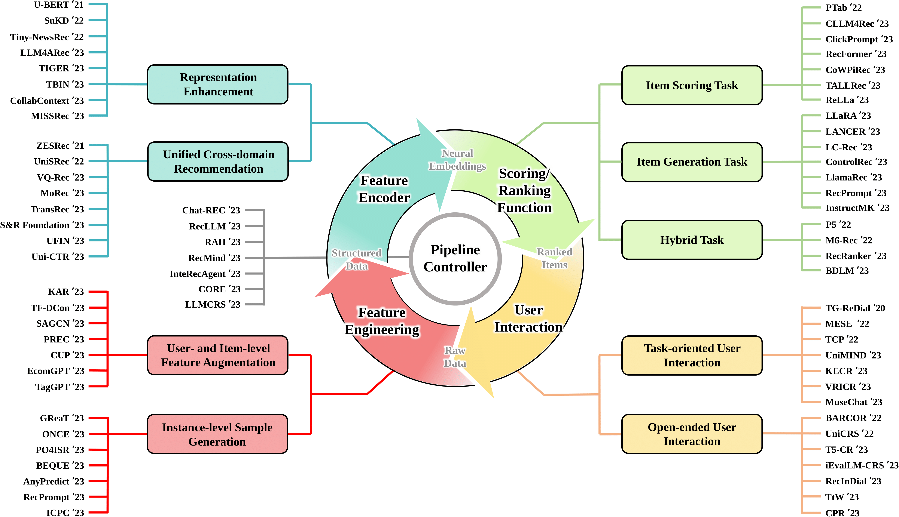

### LLM4Rec-Paper

以LLM4Rec方向为主，遵循[How Can Recommender Systems Benefit from Large Language Models: A Survey](https://arxiv.org/pdf/2306.05817v5.pdf)的分类标准

目录如下

1. [LLM &amp; RS](#1)

   🔷  1.1 [LLM for Feature Engineering](#1.1)

   🔸 1.1.1[User- and Item-level Feature Augmentation](#1.1.1)

   🔸 1.1.2[Instance-level Sample Generation](#1.1.2)

   

   🔷 1.2 [LLM as Feature Encoder](#1.2)

   🔸 1.2.1[Representation Enhancement](#1.2.1)

   🔸 1.2.2[Unified Cross-domain Recommendation](#1.2.2)

   

   🔷 1.3 [LLM as Scoring/Ranking Function](#1.3)

   🔸 1.3.1[Item Scoring Task](#1.3.1)

   🔸 1.3.2[Item Generation Task](#1.3.2)

   🔸 1.3.3[Hybrid Task](#1.3.3)

   

   🔷 1.4 [LLM for User Interaction](#1.4)
   
   🔸 1.4.1[Task-oriented User Interaction](#1.4.1)
   
   🔸 1.4.2[Open-ended User Interaction](#1.4.2)
   
   
   
   🔷 1.5 [LLM for RS Pipeline Controller](#1.5)
2. [LLM &amp; Graph](#2)
3. [Datasets &amp; Benchmarks](#3)

   🔷 3.1 [Datasets](#3.1)

   🔷 3.2 [Benchmarks](#3.2)
4. [Related Repositories](#4)

<h2 id="1">1. LLM & RS</h2>

引入LLM到推荐中的常用动机：

- LLM能以prompt方式统一各种下游推荐任务
- LLM将各模态、各特征统一以文本呈现，缓解不同模态/特征异质性问题
- LLM具有强大的语言推理能力，能更好的捕获用户的偏好
- LLM相比于传统推荐算法，具有更好的冷启动和泛化能力，因为文本特征是各用户、物品、领域所共享的
- 只有ID会缺乏世界知识，只有文本会缺乏理解推荐协同/序列交互模式，结合二者（可视为多个模态）才能充分发挥世界知识和行为知识的优势

<h3 id="1.1">1.1 LLM for Feature Engineering</h3>

<h4 id="1.1.1">1.1.1 User- and Item-level Feature Augmentation</h4>

| **Name** | **Paper**                                                                                                          | **LLM Backbone (Largest)** | **LLM Tuning Strategy** | **Publication** |                **Link**                | Main Contributions                                                                                                                                                                                                                                                                                                                                                             |
| :------------: | :----------------------------------------------------------------------------------------------------------------------- | :------------------------------: | :----------------------------: | :-------------------: | :------------------------------------------: | ------------------------------------------------------------------------------------------------------------------------------------------------------------------------------------------------------------------------------------------------------------------------------------------------------------------------------------------------------------------------------ |
|    LLM4KGC    | Knowledge Graph Completion Models are Few-shot Learners: An Empirical Study of Relation Labeling in E-commerce with LLMs |       PaLM (540B)/ ChatGPT       |             Frozen             |      Arxiv 2023      |  [[Paper]](https://arxiv.org/abs/2305.09858v1)  |                                                                                                                                                                                                                                                                                                                                                                                |
|     TagGPT     | TagGPT: Large Language Models are Zero-shot Multimodal Taggers                                                           |             ChatGPT             |             Frozen             |      Arxiv 2023      |  [[Paper]](https://arxiv.org/abs/2304.03022v1)  |                                                                                                                                                                                                                                                                                                                                                                                |
|      ICPC      | Large Language Models for User Interest Journeys                                                                         |           LaMDA (137B)           | Full Finetuning/ Prompt Tuning |      Arxiv 2023      |   [[Paper]](https://arxiv.org/abs/2305.15498)   |                                                                                                                                                                                                                                                                                                                                                                                |
|      KAR      | Towards Open-World Recommendation with Knowledge Augmentation from Large Language Models                                 |             ChatGPT             |             Frozen             |      Arxiv 2023      |   [[Paper]](https://arxiv.org/abs/2306.10933)   |                                                                                                                                                                                                                                                                                                                                                                                |
|      PIE      | Product Information Extraction using ChatGPT                                                                             |             ChatGPT             |             Frozen             |      Arxiv 2023      |   [[Paper]](https://arxiv.org/abs/2306.14921)   |                                                                                                                                                                                                                                                                                                                                                                                |
|      LGIR      | Enhancing Job Recommendation through LLM-based Generative Adversarial Networks                                           |           GhatGLM (6B)           |             Frozen             |       AAAI 2024       |   [[Paper]](https://arxiv.org/abs/2307.10747)   |                                                                                                                                                                                                                                                                                                                                                                                |
|      GIRL      | Generative Job Recommendations with Large Language Model                                                                 |            BELLE (7B)            |        Full Finetuning        |      Arxiv 2023      |   [[Paper]](https://arxiv.org/abs/2307.02157)   |                                                                                                                                                                                                                                                                                                                                                                                |
|    LLM-Rec    | LLM-Rec: Personalized Recommendation via Prompting Large Language Models                                                 |         text-davinci-003         |             Frozen             |      Arxiv 2023      |   [[Paper]](https://arxiv.org/abs/2307.15780)   |                                                                                                                                                                                                                                                                                                                                                                                |
|     HKFR✅     | Heterogeneous Knowledge Fusion: A Novel Approach for Personalized Recommendation via LLM                                 |    ChatGPT+ ChatGLM (6B)    |              LoRA              |      RecSys 2023      |   [[Paper]](https://arxiv.org/abs/2308.03333)   | 传统方法将用户异质信息与模型结合，会出现特征稀疏和知识碎片化（缺乏不同行为之间异质知识的融合）。本文通过LLM帮助提取用户不同行为中的异质知识，并使用instruct tuning的方式融合这些知识和推荐任务。                                                                                                                                                                               |
|    LLaMA-E    | LLaMA-E: Empowering E-commerce Authoring with Multi-Aspect Instruction Following                                         |           LLaMA (30B)           |              LoRA              |      Arxiv 2023      |   [[Paper]](https://arxiv.org/abs/2308.04913)   |                                                                                                                                                                                                                                                                                                                                                                                |
|    EcomGPT    | EcomGPT: Instruction-tuning Large Language Models with Chain-of-Task Tasks for E-commerce                                |          BLOOMZ (7.1B)          |        Full Finetuning        |      Arxiv 2023      |   [[Paper]](https://arxiv.org/abs/2308.06966)   |                                                                                                                                                                                                                                                                                                                                                                                |
|    TF-DCon    | Leveraging Large Language Models (LLMs) to Empower Training-Free Dataset Condensation for Content-Based Recommendation   |             ChatGPT             |             Frozen             |      Arxiv 2023      |   [[Paper]](https://arxiv.org/abs/2310.09874)   |                                                                                                                                                                                                                                                                                                                                                                                |
|    RLMRec✅    | Representation Learning with Large Language Models for Recommendation                                                    |             ChatGPT             |             Frozen             |       WWW 2024       |    [[Code]](https://github.com/HKUDS/RLMRec)    | 推荐隐式数据包含噪声和偏差；使用LLM推荐存在扩展性不足、输入长度限制等不足。本文目的是通过LLM强大语言理解能力挖掘用户行为和偏好，同时保留已有推荐器的效率和准确度。贡献有1. 基于推理的用户和物品提示生成；2. 提出对比式和掩码生成式两个方法；3.从互信息角度分析引入文本信号对于提升表示质量的有效性                                                                             |
|    LLMRec✅    | LLMRec: Large Language Models with Graph Augmentation for Recommendation                                                 |             ChatGPT             |             Frozen             |       WSDM 2024       |    [[Code]](https://github.com/HKUDS/LLMRec)    | 数据稀疏可以通过side information解决，但是这些信息也会包含噪声、可用性低和数据质量低等问题，反过来伤害了推荐准确率。本文提出方法从用户-物品交互边、用户画像、物品节点属性三角度增强数据；并提出对增强的交互和特征分别设计剪枝、MAE方法去噪。                                                                                                                                   |
|     LLMRG     | Enhancing Recommender Systems with Large Language Model Reasoning Graphs                                                 |               GPT4               |             Frozen             |      Arxiv 2023      |   [[Paper]](https://arxiv.org/abs/2308.10835)   |                                                                                                                                                                                                                                                                                                                                                                                |
|      CUP      | Recommendations by Concise User Profiles from Review Text                                                                |             ChatGPT             |             Frozen             |      Arxiv 2023      |   [[Paper]](https://arxiv.org/abs/2311.01314)   |                                                                                                                                                                                                                                                                                                                                                                                |
|     SINGLE     | Modeling User Viewing Flow using Large Language Models for Article Recommendation                                        |             ChatGPT             |             Frozen             |      Arxiv 2023      |   [[Paper]](https://arxiv.org/abs/2311.07619)   |                                                                                                                                                                                                                                                                                                                                                                                |
|     SAGCN     | Understanding Before Recommendation: Semantic Aspect-Aware Review Exploitation via Large Language Models                 |           Vicuna (13B)           |             Frozen             |      Arxiv 2023      |   [[Paper]](https://arxiv.org/abs/2312.16275)   |                                                                                                                                                                                                                                                                                                                                                                                |
|      UEM      | User Embedding Model for Personalized Language Prompting                                                                 |       FLAN-T5-base (250M)       |        Full Finetuning        |      Arxiv 2024      |   [[Paper]](https://arxiv.org/abs/2401.04858)   |                                                                                                                                                                                                                                                                                                                                                                                |
|     LLMHG     | LLM-Guided Multi-View Hypergraph Learning for Human-Centric Explainable Recommendation                                   |               GPT4               |             Frozen             |      Arxiv 2024      |   [[Paper]](https://arxiv.org/abs/2401.08217)   |                                                                                                                                                                                                                                                                                                                                                                                |
|   Llama4Rec   | Integrating Large Language Models into Recommendation via Mutual Augmentation and Adaptive Aggregation                   |           LLaMA2 (7B)           |        Full Finetuning        |      Arxiv 2024      |   [[Paper]](https://arxiv.org/abs/2401.13870)   |                                                                                                                                                                                                                                                                                                                                                                                |
|    LLMHG✅    | LLM-Guided Multi-View Hypergraph Learning for Human-Centric Explainable Recommendation                                   |               GPT4               |             Frozen             |      Arxiv 2024      | [[Paper]](https://arxiv.org/pdf/2401.08217.pdf) | 仅依赖交互历史不能完全捕捉人类兴趣的多面偏好。本文提出使用LLM从用户序列中推导出多个Interest Angles(IAs)，再基于IA将物品划分多个组（形成超边）。此外，由于LLM可能无法考虑到所有物品的特性，以及由于概率推理的本质，可能产生不正确的推理导致次优的IA提取，本文进一步设计后处理方法，利用超边内实体靠近和超边之间拉远的方法进行超图结构化学习。最后结合超图神经网络算法预测分数。 |

<h4 id="1.1.2">1.1.2 Instance-level Sample Generation</h4>

| **Name** | **Paper**                                                                                                           |   **LLM Backbone (Largest)**   | **LLM Tuning Strategy** | **Publication** |              **Link**              | Main Contributions                                                                                                                                                                                                                                                                      |
| :------------: | :------------------------------------------------------------------------------------------------------------------------ | :----------------------------------: | :---------------------------: | :-------------------: | :--------------------------------------: | --------------------------------------------------------------------------------------------------------------------------------------------------------------------------------------------------------------------------------------------------------------------------------------- |
|     GReaT     | Language Models are Realistic Tabular Data Generators                                                                     |          GPT2-medium (355M)          |        Full Finetuning        |       ICLR 2023       | [[Paper]](https://arxiv.org/abs/2210.06280) |                                                                                                                                                                                                                                                                                         |
|     ONCE✅     | ONCE: Boosting Content-based Recommendation with Both Open- and Closed-source Large Language Models                       | ChatGPT+ LLaMA2(7B)/LLaMA2(13B) |             LoRA             |       WSDM 2024       |   [[Code]](https://github.com/Jyonn/ONCE)   | 传统content-based推荐算法停留在捕捉word级别的相似度，而无法实现content级别。本文提出同时利用开源和闭源的LLM帮助增强对物品和用户信息内容的理解。开源LLM用于编码用户和物品表示；闭源LLM用于物品内容丰富、用户兴趣抽象、（冷启动）用户内容生成。并使用LoRA、冻结低层，缓存机制等提高效率。ONCE方法结合开源和闭源LLM的方法 |
|   AnyPredict   | AnyPredict: Foundation Model for Tabular Prediction                                                                       |               ChatGPT               |            Frozen            |      Arxiv 2023      | [[Paper]](https://arxiv.org/abs/2305.12081) |                                                                                                                                                                                                                                                                                         |
|     DPLLM     | Privacy-Preserving Recommender Systems with Synthetic Query Generation using Differentially Private Large Language Models |              T5-XL (3B)              |        Full Finetuning        |      Arxiv 2023      | [[Paper]](https://arxiv.org/abs/2305.05973) |                                                                                                                                                                                                                                                                                         |
|      MINT      | Large Language Model Augmented Narrative Driven Recommendations                                                           |           text-davinci-003           |            Frozen            |      RecSys 2023      | [[Paper]](https://arxiv.org/abs/2306.02250) |                                                                                                                                                                                                                                                                                         |
|   Agent4Rec   | On Generative Agents in Recommendation                                                                                    |               ChatGPT               |            Frozen            |      Arxiv 2023      | [[Paper]](https://arxiv.org/abs/2310.10108) |                                                                                                                                                                                                                                                                                         |
|   RecPrompt   | RecPrompt: A Prompt Tuning Framework for News Recommendation Using Large Language Models                                  |                 GPT4                 |            Frozen            |      Arxiv 2023      | [[Paper]](https://arxiv.org/abs/2312.10463) |                                                                                                                                                                                                                                                                                         |
|     BEQUE     | Large Language Model based Long-tail Query Rewriting in Taobao Search                                                     |             ChatGLM (6B)             |        Full Finetuning        |      WWW 2024      | [[Paper]](https://arxiv.org/abs/2311.03758) |                                                                                                                                                                                                                                                                                         |
| Agent4Ranking | Agent4Ranking: Semantic Robust Ranking via Personalized Query Rewriting Using Multi-agent LLM                             |               ChatGPT               |            Frozen            |      Arxiv 2023      | [[Paper]](https://arxiv.org/abs/2312.15450) |                                                                                                                                                                                                                                                                                         |
| OpenGraph✅ | OpenGraph: Towards Open Graph Foundation Models | ChatGPT | Frozen | Arxiv 2024 | [[Code]](https://github.com/HKUDS/OpenGraph/tree/main) | OpenGraph算法提供一个通用且可扩展的图模型，能够实现零样本学习并适应不同领域的图结构。受限提出一个通用tokenizer将输入图变换为一个统一token序列，使得能够在不同图上进行良好的泛化；设计了一个可扩展的图transformer作为encoder，捕捉全局拓扑上下文中的节点的依赖关系；引入LLM的数据增强机制，使用Tree-of-Prompt迭代地将一般节点划分为具有更精细语义粒度的子类别实体作为叶子结点，并利用Bibbs采样得到生成节点集，以及设计Node-wise connection概率预测方法；引入了一种将局部性概念纳入边缘生成过程的方法防止创造过多的连接。 |

<h3 id="1.2">1.2 LLM as Feature Encoder</h3>
<h4 id="1.2.1">1.2.1 Representation Enhancement</h4>

| **Name** | **Paper**                                                                                                                      | **LLM Backbone (Largest)** | **LLM Tuning Strategy** | **Publication** |                                     **Link**                                     | Main Contributions                                                                                                                                                                                                                                                                                                                                                                                     |
| :------------: | :----------------------------------------------------------------------------------------------------------------------------------- | :------------------------------: | :---------------------------: | :-------------------: | :------------------------------------------------------------------------------------: | ------------------------------------------------------------------------------------------------------------------------------------------------------------------------------------------------------------------------------------------------------------------------------------------------------------------------------------------------------------------------------------------------------ |
|     U-BERT     | U-BERT: Pre-training User Representations for Improved Recommendation                                                                |         BERT-base (110M)         |        Full Finetuning        |       AAAI 2021       |             [[Paper]](https://ojs.aaai.org/index.php/AAAI/article/view/16557)             |                                                                                                                                                                                                                                                                                                                                                                                                        |
|     UNBERT     | UNBERT: User-News Matching BERT for News Recommendation                                                                              |         BERT-base (110M)         |        Full Finetuning        |      IJCAI 2021      |                   [[Paper]](https://www.ijcai.org/proceedings/2021/462)                   |                                                                                                                                                                                                                                                                                                                                                                                                        |
|     PLM-NR     | Empowering News Recommendation with Pre-trained Language Models                                                                      |       RoBERTa-base (125M)       |        Full Finetuning        |      SIGIR 2021      |                        [[Paper]](https://arxiv.org/abs/2104.07413)                        |                                                                                                                                                                                                                                                                                                                                                                                                        |
| Pyramid-ERNIE | Pre-trained Language Model based Ranking in Baidu Search                                                                             |           ERNIE (110M)           |        Full Finetuning        |       KDD 2021       |                        [[Paper]](https://arxiv.org/abs/2105.11108)                        |                                                                                                                                                                                                                                                                                                                                                                                                        |
|    ERNIE-RS    | Pre-trained Language Model for Web-scale Retrieval in Baidu Search                                                                   |           ERNIE (110M)           |        Full Finetuning        |       KDD 2021       |                        [[Paper]](https://arxiv.org/abs/2106.03373)                        |                                                                                                                                                                                                                                                                                                                                                                                                        |
|    CTR-BERT    | CTR-BERT: Cost-effective knowledge distillation for billion-parameter teacher models                                                 |      Customized BERT (1.5B)      |        Full Finetuning        |      ENLSP 2021      | [[Paper]](https://neurips2021-nlp.github.io/papers/20/CameraReady/camera_ready_final.pdf) |                                                                                                                                                                                                                                                                                                                                                                                                        |
|      SuKD      | Learning Supplementary NLP Features for CTR Prediction in Sponsored Search                                                           |       RoBERTa-large (355M)       |        Full Finetuning        |       KDD 2022       |               [[Paper]](https://dl.acm.org/doi/abs/10.1145/3534678.3539064)               |                                                                                                                                                                                                                                                                                                                                                                                                        |
|      PREC      | Boosting Deep CTR Prediction with a Plug-and-Play Pre-trainer for News Recommendation                                                |         BERT-base (110M)         |        Full Finetuning        |      COLING 2022      |                  [[Paper]](https://aclanthology.org/2022.coling-1.249/)                  |                                                                                                                                                                                                                                                                                                                                                                                                        |
|     MM-Rec     | MM-Rec: Visiolinguistic Model Empowered Multimodal News Recommendation                                                               |         BERT-base (110M)         |        Full Finetuning        |      SIGIR 2022      |               [[Paper]](https://dl.acm.org/doi/abs/10.1145/3477495.3531896)               |                                                                                                                                                                                                                                                                                                                                                                                                        |
|  Tiny-NewsRec  | Tiny-NewsRec: Effective and Efficient PLM-based News Recommendation                                                                  |       UniLMv2-base (110M)       |        Full Finetuning        |      EMNLP 2022      |                        [[Paper]](https://arxiv.org/abs/2112.00944)                        |                                                                                                                                                                                                                                                                                                                                                                                                        |
|    PLM4Tag    | PTM4Tag: Sharpening Tag Recommendation of Stack Overflow Posts with Pre-trained Models                                               |         CodeBERT (125M)         |        Full Finetuning        |       ICPC 2022       |                        [[Paper]](https://arxiv.org/abs/2203.10965)                        |                                                                                                                                                                                                                                                                                                                                                                                                        |
|   TwHIN-BERT   | TwHIN-BERT: A Socially-Enriched Pre-trained Language Model for Multilingual Tweet Representations                                    |         BERT-base (110M)         |        Full Finetuning        |      Arxiv 2022      |                        [[Paper]](https://arxiv.org/abs/2209.07562)                        |                                                                                                                                                                                                                                                                                                                                                                                                        |
|      LSH      | Improving Code Example Recommendations on Informal Documentation Using BERT and Query-Aware LSH: A Comparative Study                 |         BERT-base (110M)         |        Full Finetuning        |      Arxiv 2023      |                       [[Paper]](https://arxiv.org/abs/2305.03017v1)                       |                                                                                                                                                                                                                                                                                                                                                                                                        |
|  LLM2BERT4Rec  | Leveraging Large Language Models for Sequential Recommendation                                                                       |      text-embedding-ada-002      |            Frozen            |      RecSys 2023      |                        [[Paper]](https://arxiv.org/abs/2309.09261)                        |                                                                                                                                                                                                                                                                                                                                                                                                        |
|    LLM4ARec    | Prompt Tuning Large Language Models on Personalized Aspect Extraction for Recommendations                                            |           GPT2 (110M)           |         Prompt Tuning         |      Arxiv 2023      |                        [[Paper]](https://arxiv.org/abs/2306.01475)                        |                                                                                                                                                                                                                                                                                                                                                                                                        |
|     TIGER     | Recommender Systems with Generative Retrieval                                                                                        |           Sentence-T5           |            Frozen            |       NIPS 2023       |                        [[Paper]](https://arxiv.org/abs/2305.05065)                        |                                                                                                                                                                                                                                                                                                                                                                                                        |
|      TBIN      | TBIN: Modeling Long Textual Behavior Data for CTR Prediction                                                                         |         BERT-base (110M)         |            Frozen            |    DLP-RecSys 2023    |                        [[Paper]](https://arxiv.org/abs/2308.08483)                        |                                                                                                                                                                                                                                                                                                                                                                                                        |
|     LKPNR     | LKPNR: LLM and KG for Personalized News Recommendation Framework                                                                     |           LLaMA2 (7B)           |            Frozen            |      Arxiv 2023      |                        [[Paper]](https://arxiv.org/abs/2308.12028)                        |                                                                                                                                                                                                                                                                                                                                                                                                        |
|      SSNA      | Towards Efficient and Effective Adaptation of Large Language Models for Sequential Recommendation                                    |     DistilRoBERTa-base (83M)     |   Layerwise Adapter Tuning   |      Arxiv 2023      |                        [[Paper]](https://arxiv.org/abs/2310.01612)                        |                                                                                                                                                                                                                                                                                                                                                                                                        |
| CollabContext | Collaborative Contextualization: Bridging the Gap between Collaborative Filtering and Pre-trained Language Model                     |       Instructor-XL (1.5B)       |            Frozen            |      Arxiv 2023      |                        [[Paper]](https://arxiv.org/abs/2310.09400)                        |                                                                                                                                                                                                                                                                                                                                                                                                        |
|   LMIndexer   | Language Models As Semantic Indexers                                                                                                 |          T5-base (223M)          |        Full Finetuning        |      Arxiv 2023      |                        [[Paper]](https://arxiv.org/abs/2310.07815)                        |                                                                                                                                                                                                                                                                                                                                                                                                        |
|     Stack     | A BERT based Ensemble Approach for Sentiment Classification of Customer Reviews and its Application to Nudge Marketing in e-Commerce |         BERT-base (110M)         |            Frozen            |      Arxiv 2023      |                        [[Paper]](https://arxiv.org/abs/2311.10782)                        |                                                                                                                                                                                                                                                                                                                                                                                                        |
|      N/A      | Utilizing Language Models for Tour Itinerary Recommendation                                                                          |         BERT-base (110M)         |        Full Finetuning        |    PMAI@IJCAI 2023    |                        [[Paper]](https://arxiv.org/abs/2311.12355)                        |                                                                                                                                                                                                                                                                                                                                                                                                        |
|      UEM      | User Embedding Model for Personalized Language Prompting                                                                             |     Sentence-T5-base (223M)     |            Frozen            |      Arxiv 2024      |                        [[Paper]](https://arxiv.org/abs/2401.04858)                        |                                                                                                                                                                                                                                                                                                                                                                                                        |
|   Social-LLM   | Social-LLM: Modeling User Behavior at Scale using Language Models and Social Network Data                                            |     SBERT-MPNet0base (110M)     |            Frozen            |      Arxiv 2024      |                        [[Paper]](https://arxiv.org/abs/2401.00893)                        |                                                                                                                                                                                                                                                                                                                                                                                                        |
|     LLMRS     | LLMRS: Unlocking Potentials of LLM-Based Recommender Systems for Software Purchase                                                   |           MPNet (110M)           |            Frozen            |      Arxiv 2024      |                        [[Paper]](https://arxiv.org/abs/2401.06676)                        |                                                                                                                                                                                                                                                                                                                                                                                                        |
|    GaCLLM✅    | Large Language Model with Graph Convolution for Recommendation                                                                       |           ChatGLM (6B)           |             LoRA             |      Arxiv 2024      |                      [[Paper]](https://arxiv.org/pdf/2402.08859.pdf)                      | 现有LLM推荐忽略了用户-物品交互的结构化知识。本文提出利用LLM捕捉高阶的用户-物品关系。首先，在具体domain上执行SFT训练，对齐用户和物品的描述；第二，递归地从少到多融合邻居信息。最后，通过拼接图embedding表示和LLM图表示，内积计算u-i得分。                                                                                                                                                               |
|     SLIM✅     | Can Small Language Models be Good Reasoners for Sequential Recommendation?                                                           |           LLaMA2 (7B)           |             LoRA             |       WWW 2024       |                      [[Paper]](https://arxiv.org/pdf/2403.04260.pdf)                      | 传统推荐模型依赖于闭式的训练数据集，不可避免引入曝光偏差和流行度偏差，而LLM具有强大推理能力，具有丰富的开放世界知识，理解交互行为的本质。本文提出用chatgpt的cot能力蒸馏到小LLM（如Llama2），再基于CoT推理过程分别使用到ID-Based和ID-Agnostic场景下，实现性能大幅提升。其中，CoT推理输出和历史交互物品信息都用额外的Bert进行编码，ID-Based是拼接物品信息和ID表示；ID-Agnostic是直接基于文本相似度计算。 |
| LSVCR✅ | A Large Language Model Enhanced Sequential Recommender for Joint Video and Comment Recommendation | ChatGLM3 | LoRA | Arxiv 2024 | [[Code]](https://github.com/RUCAIBox/LSVCR/) | 在快手平台，执行视频推荐和评论推荐任务。主要是用LLM对文本进行编码得到文本表示。LLM只在训练过程中使用（部署时抛弃），对评论序列和视频序列进行编码。1. 利用对比学习进行偏好对齐（不同序列之间），其中LLM输出会进行增强（如视频会用不同火热评论，评论会混合真实评论和LLM生成的虚拟评论）；2.对视频-文本之间的表示进行对比学习；3. LLM本身的自回归训练；4.序列模型CE 损失。第二阶段微调，目标是ID embedding和文本embedding的对比损失。 |
| BAHE✅ | Breaking the Length Barrier: LLM-Enhanced CTR Prediction in Long Textual User Behaviors | Qwen-1 （8B） | LoRA | SIGIR 2024 | [[Paper]](https://arxiv.org/pdf/2403.19347.pdf) | 将用户行为划分为原子操作（比如点击了xxx，yyy加入购物车等），先用LLM低层（低层冻结）编码这些原子行为，得到行为数 * 纬度的embedding table，即将token-level转化为behavior-level，LLM高层对行为embedding进行编码得到输出，最后喂入CTR模型预估点击率。 |
| LEASR✅ | Reinforcement Learning-based Recommender Systems with Large Language Models for State Reward and Action Modeling | Mistral (7B) | LoRA | SIGIR 2024 | [[Paper]](https://arxiv.org/pdf/2403.16948) | 已有offline RL推荐难以获取有效用户反馈，且如何建模用户状态和reward同样也具有挑战。正向或者负向action设置统一的reward不具有区分性；基于物品ID生成的用户状态不能反映特定内容的行为；offline在固定的数据上训练，正负反馈不足。本文提出LLM作为环境（LE），创新点有：引入item tokenization得到物品的语义embedding，后续物品ID序列表示会和语义表示concat融合；设计Reward Model和State Model（二者都有对应专门设置的loss）；利用LE增强数据，对未见用户反馈的下一次物品（来自ID序列的top-5物品）选取概率最高者作为增强序列。 |
| NoteLLM✅ | NoteLLM: A Retrievable Large Language Model for Note Recommendation | LLaMA2 (7B) | Full Finetuning | WWW 2024 | [[Paper]](https://arxiv.org/pdf/2403.01744) | NoteLLM通过学习用户行为和生成关键概念来提高用户的论文推荐和标签生成体验。动机是文章认为tag/category生成和embedding生成都其实是对关键信息的压缩，因此前者对embedding生成是有好处的。具体实现是通过在prompt里面添加[EMB],\<Output\>来获取物品embedding和tag生成。二者分别对应目标函数的对比学习和CE学习部分。 |
| LRD✅ | Sequential Recommendation with Latent Relations based on Large Language Model | GPT-3 (175B) | Frozen | SIGIR 2024 | [[Code]](https://github.com/ysh-1998/LRD) | 现有关系感知序列模型使用预定义的关系，容易遇到稀疏性问题。本文采用LLM挖掘物品之间的隐藏关系。首先对物品描述用LLM来抽取表示，利用DVAE思想提取物品对背后的关系，再基于提取出表示和连接物品重构目标物品；对于已有定义的关系，也会引入知识图谱的优化目标；再加上推荐本身的目标进行多任务联合学习。 |
| CTRL✅ | CTRL: Connect Collaborative and Language Model for CTR Prediction | RoBERTa | Frozen | Arxiv 2023 | [[Paper]](https://arxiv.org/pdf/2306.02841) | 提出CTRL将协同信号和语义信号结合起来。具体是提出两阶段训练方法：一阶段是执行文本表示和CTR协同模型表示进行对比学习；二阶段是对协同模型在下游任务上进行SFT微调。 |
| EAGER✅ | EAGER: Two-Stream Generative Recommender with Behavior-Semantic Collaboration | Sentence-T5 | Frozen | KDD 2024 | [[Code]](https://github.com/yewzz/EAGER) | 现有生成式推荐要么只关注语义，要么只关注行为知识，忽略了二者的互补性。故提出EAGER，作为一种双流生成架构，利用共享encoder和分离decoder，辅以基于置信度的排序策略。此外，提出使用summary token的全局对比任务实现每种类型（行为和语义）的区分性解码，以及语义引导的迁移任务，通过设计的重构和识别目标提升行为和语义的交叉能力。 |

<h4 id="1.2.2">1.2.2 Unified Cross-domain Recommendation</h4>

|  **Name**  | **Paper**                                                                                                        |    **LLM Backbone (Largest)**    | **LLM Tuning Strategy** | **Publication** |                   **Link**                   | Main Contributions                                                                                                                                                                                                                                                                                                                                                                                                                                                                    |
| :--------------: | :--------------------------------------------------------------------------------------------------------------------- | :-------------------------------------: | :---------------------------: | :-------------------: | :------------------------------------------------: | ------------------------------------------------------------------------------------------------------------------------------------------------------------------------------------------------------------------------------------------------------------------------------------------------------------------------------------------------------------------------------------------------------------------------------------------------------------------------------------- |
|      ZESRec      | Zero-Shot Recommender Systems                                                                                          |            BERT-base (110M)            |            Frozen            |      Arxiv 2021      |      [[Paper]](https://arxiv.org/abs/2105.08318)      |                                                                                                                                                                                                                                                                                                                                                                                                                                                                                       |
|    UniSRec✅    | Towards Universal Sequence Representation Learning for Recommender Systems                                             |            BERT-base (110M)            |            Frozen            |       KDD 2022       |     [[Code]](https://github.com/RUCAIBox/UniSRec)     | 基于物品ID序列推荐难以实现跨域迁移。UniSRec提出使用物品文本信息表示物品，学习通用物品表示和通用序列表示。为了学习通用物品表示，使用参数白化（因为BERT容易出现非平滑各向异性表征空间）和MOE结构（不同域之间存在语义gap，使用MOE自适应组合物品表示实现迁移和融合不同域的信息）。为了实现通用序列表示，提出序列-物品和序列-序列的对比任务（序列是通过word drop和item drop实现）。对于fine-tune阶段，根据inductive和transductive设置，分别考虑是否融合ID信息。参数高效微调只训练MOE参数。 |
|     TransRec     | TransRec: Learning Transferable Recommendation from Mixture-of-Modality Feedback                                       |            BERT-base (110M)            |        Full Finetuning        |      Arxiv 2022      |      [[Paper]](https://arxiv.org/abs/2206.06190)      |                                                                                                                                                                                                                                                                                                                                                                                                                                                                                       |
|      VQ-Rec      | Learning Vector-Quantized Item Representation for Transferable Sequential Recommenders                                 |            BERT-base (110M)            |            Frozen            |       WWW 2023       |      [[Paper]](https://arxiv.org/abs/2210.12316)      |                                                                                                                                                                                                                                                                                                                                                                                                                                                                                       |
| IDRec vs MoRec✅ | Where to Go Next for Recommender Systems? ID- vs. Modality-based Recommender Models Revisited                          |            BERT-base (110M)            |        Full Finetuning        |      SIGIR 2023      | [[Code]](https://github.com/westlake-repl/IDvs.MoRec) | 研究纯ID-based推荐和纯modality-based推荐，发现使用预训练的encoder进行end2end训练，能够持平甚至超过ID-based推荐算法（甚至对于非冷启动物品）。                                                                                                                                                                                                                                                                                                                                     |
|     TransRec     | Exploring Adapter-based Transfer Learning for Recommender Systems: Empirical Studies and Practical Insights            |           RoBERTa-base (125M)           |   Layerwise Adapter Tuning   |      Arxiv 2023      |      [[Paper]](https://arxiv.org/abs/2305.15036)      |                                                                                                                                                                                                                                                                                                                                                                                                                                                                                       |
|       TCF       | Exploring the Upper Limits of Text-Based Collaborative Filtering Using Large Language Models: Discoveries and Insights |             OPT-175B (175B)             |    Frozen/ Full Finetuning    |      Arxiv 2023      |      [[Paper]](https://arxiv.org/abs/2305.11700)      |                                                                                                                                                                                                                                                                                                                                                                                                                                                                                       |
| S&R Foundation✅ | An Unified Search and Recommendation Foundation Model for Cold-Start Scenario                                          | ChatGLM (6B) |            Frozen            |       CIKM 2023       |      [[Paper]](https://arxiv.org/abs/2309.08939)      | 提出联合搜索推荐的多域基石模型，利用LLM从搜索文本和推荐商品文本信息中提取域不变特征，利用（三种）Aspect Gating Fusion技术合并ID、域不变特征、任务特定稀疏特征获得最终搜索和物品的表示，同时使用域自适应技术（JS散度）限制域分布的发散程度。使用来自搜索和推荐任务的样本联合训练，遵循pretrain-finetuning范式。                                                                                                                                                                       |
|     MISSRec     | MISSRec: Pre-training and Transferring Multi-modal Interest-aware Sequence Representation for Recommendation           |            CLIP-B/32 (400M)            |        Full Finetuning        |        MM 2023        |      [[Paper]](https://arxiv.org/abs/2308.11175)      |                                                                                                                                                                                                                                                                                                                                                                                                                                                                                       |
|      UFIN✅      | UFIN: Universal Feature Interaction Network for Multi-Domain Click-Through Rate Prediction                             |           FLAN-T5-base (250M)           |            Frozen            |      Arxiv 2023      |      [[Code]](https://github.com/Ethan-TZ/UFIN)      | 已有跨域方法由于依赖于ID特征，难以很好地实现特征迁移。本文提出使用文本数据学习通用特征交互，从而有效在各个域上迁移。具体地，将文本和特征视作两个模态，利用基于LLM的encoder-decoder网络结构加强从文本到特征模态的迁移效果（原始特征->文本->通用特征）；并利用MOE增强的自适应特征交互模型学习可迁移的特征交互；最后提出多域知识蒸馏框架训练模型。                                                                                                                                       |
|      PMMRec      | Multi-Modality is All You Need for Transferable Recommender Systems                                                    |          RoBERTa-large (355M)          |    Top-2-layer Finetuning    |       ICDE 2024       |      [[Paper]](https://arxiv.org/abs/2312.09602)      |                                                                                                                                                                                                                                                                                                                                                                                                                                                                                       |
|     Uni-CTR     | A Unified Framework for Multi-Domain CTR Prediction via Large Language Models                                          |          Sheared-LLaMA (1.3B)          |             LoRA             |      Arxiv 2023      |      [[Paper]](https://arxiv.org/abs/2312.10743)      |                                                                                                                                                                                                                                                                                                                                                                                                                                                                                       |

<h3 id="1.3"> 1.3 LLM as Scoring/Ranking Function </h3>

<h4 id="1.3.1">1.3.1 Item Scoring Task</h4>

| **Name** | **Paper**                                                                                                     | **LLM Backbone (Largest)** |     **LLM Tuning Strategy**     | **Publication** |                         **Link**                         | Main Contributions                                                                                                                                                                                                                                                                                                                                                                                                                                                                               |
| :------------: | :------------------------------------------------------------------------------------------------------------------ | :------------------------------: | :------------------------------------: | :-------------------: | :-------------------------------------------------------------: | ------------------------------------------------------------------------------------------------------------------------------------------------------------------------------------------------------------------------------------------------------------------------------------------------------------------------------------------------------------------------------------------------------------------------------------------------------------------------------------------------ |
|    LMRecSys    | Language Models as Recommender Systems: Evaluations and Limitations                                                 |          GPT2-XL (1.5B)          |            Full Finetuning            |      ICBINB 2021      |       [[Paper]](https://openreview.net/forum?id=hFx3fY7-m9b)       |                                                                                                                                                                                                                                                                                                                                                                                                                                                                                                  |
|      PTab      | PTab: Using the Pre-trained Language Model for Modeling Tabular Data                                                |         BERT-base (110M)         |            Full Finetuning            |      Arxiv 2022      |            [[Paper]](https://arxiv.org/abs/2209.08060)            |                                                                                                                                                                                                                                                                                                                                                                                                                                                                                                  |
|   UniTRec✅   | UniTRec: A Unified Text-to-Text Transformer and Joint Contrastive Learning Framework for Text-based Recommendation  |           BART (406M)           |            Full Finetuning            |       ACL 2023       |      [[Code]](https://github.com/Veason-silverbullet/UniTRec)      | PLM处理用户历史物品的文本信息存在两种方法，但都有不足：(a). 直接将全部物品历史作为输入文本作为用户全局表示，忽略了不同物品文本之间的关系，而是把所有词都视作同等参与；(b).引入额外聚合网络，这削弱了PLM 编码器的表达能力。本文贡献：(a). 对注意力掩码操作设计word-level和turn-level两种机制 (b).联合训练基于Discriminative Scores和Candidate Text Perplexity的对比损失。                                                                                                                         |
|   Prompt4NR   | Prompt Learning for News Recommendation                                                                             |         BERT-base (110M)         |            Full Finetuning            |      SIGIR 2023      |            [[Paper]](https://arxiv.org/abs/2304.05263)            |                                                                                                                                                                                                                                                                                                                                                                                                                                                                                                  |
|  RecFormer✅  | Text Is All You Need: Learning Language Representations for Sequential Recommendation                               |        LongFormer (149M)        |            Full Finetuning            |       KDD 2023       |          [[Code]](https://github.com/AaronHeee/RecFormer)          | ID-based推荐难以解决冷启动问题；已有跨域推荐工作通常假设有重叠特征、物品或者用户等，这限制了算法应用。基于预训练语言模型的应用存在问题:(a)预训练文本和物品文本存在领域差异;(b)无法建模细粒度用户偏好。本文提出以key-value形式表达物品文本，修改LongFormer通过加入特殊设计Token Embedding，以及预训练+两阶段微调。                                                                                                                                                                                |
|     TabLLM     | TabLLM: Few-shot Classification of Tabular Data with Large Language Models                                          |             T0 (11B)             | Few-shot Parameter-effiecnt Finetuning |     AISTATS 2023     |            [[Paper]](https://arxiv.org/abs/2210.10723)            |                                                                                                                                                                                                                                                                                                                                                                                                                                                                                                  |
| Zero-shot GPT | Zero-Shot Recommendation as Language Modeling                                                                       |        GPT2-medium (355M)        |                 Frozen                 |      Arxiv 2023      |            [[Paper]](https://arxiv.org/abs/2112.04184)            |                                                                                                                                                                                                                                                                                                                                                                                                                                                                                                  |
|   FLAN-T5✅   | Do LLMs Understand User Preferences? Evaluating LLMs On User Rating Prediction                                      |         FLAN-5-XXL (11B)         |            Full Finetuning            |    PGAI@CIKM 2023    |          [[Paper]](https://arxiv.org/pdf/2305.06474.pdf)          | 1. 超过100B的模型在冷启动情况下与启发式方法接近的性能；2. zero-shot情况下仍然无法抗衡监督学习下的传统推荐模型；3. Fine-Tuned 的模型仅需要少量数据就能持平甚至超过传统模型；                                                                                                                                                                                                                                                                                                    |
|    BookGPT    | BookGPT: A General Framework for Book Recommendation Empowered by Large Language Model                              |             ChatGPT             |                 Frozen                 |      Arxiv 2023      |           [[Paper]](https://arxiv.org/abs/2305.15673v1)           |                                                                                                                                                                                                                                                                                                                                                                                                                                                                                                  |
|   TALLRec✅   | TALLRec: An Effective and Efficient Tuning Framework to Align Large Language Model with Recommendation              |            LLaMA (7B)            |                  LoRA                  |      RecSys 2023      |           [[Code]](https://github.com/SAI990323/TALLRec)           | LLM和推荐任务存在gap，面向推荐的语料库不足；此外，LLM存在一定限制无法保证输出包含目标物品（如拒绝回答，或全部positive回答）。具体包括两阶段微调，一阶段是使用 self-instruct数据微调LLM，二阶段是利用instruction数据微调LLM。                                                                                                                                                                                                                                                                     |
|      PBNR      | PBNR: Prompt-based News Recommender System                                                                          |          T5-small (60M)          |            Full Finetuning            |      Arxiv 2023      |            [[Paper]](https://arxiv.org/abs/2304.07862)            |                                                                                                                                                                                                                                                                                                                                                                                                                                                                                                  |
|    CR-SoRec    | CR-SoRec: BERT driven Consistency Regularization for Social Recommendation                                          |         BERT-base (110M)         |            Full Finetuning            |      RecSys 2023      | [[Paper]](https://dl.acm.org/doi/fullHtml/10.1145/3604915.3608844) |                                                                                                                                                                                                                                                                                                                                                                                                                                                                                                  |
|     GLRec     | Exploring Large Language Model for Graph Data Understanding in Online Job Recommendations                           |         BELLE-LLaMA (7B)         |                  LoRA                  |      Arxiv 2023      |            [[Paper]](https://arxiv.org/abs/2307.05722)            |                                                                                                                                                                                                                                                                                                                                                                                                                                                                                                  |
|   BERT4CTR✅   | BERT4CTR: An Efficient Framework to Combine Pre-trained Language Model with Non-textual Features for CTR Prediction |       RoBERTa-large (355M)       |            Full Finetuning            |       KDD 2023       |   [[Paper]](https://dl.acm.org/doi/abs/10.1145/3580305.3599780)   | 融合非文本特征（sparse和dense feature）到LM是有挑战性的。本文提出Uni-Attention方法，非文本特征取消位置编码，同时改变其Attention方式，非文本特征作为Q，文本特征作为V和K。                                                                                                                                                                                                                                                                                                                         |
|    ReLLa✅    | ReLLa: Retrieval-enhanced Large Language Models for Lifelong Sequential Behavior Comprehension in Recommendation    |           Vicuna (13B)           |                  LoRA                  |       WWW 2024       |            [[Code]](https://github.com/LaVieEnRose365/ReLLa)            | 实验发现推荐场景中，并非用户历史序列越长效果越好。本文提出使用semantic user behavior retrieval (SUBR)代替最近K个交互历史来提升数据质量。对于zero-shot，不tune模型而直接使用SUBR；对于few-shot，除了使用SUBR，还要用原始和SUBR增强的数据来训练模型。SUBR具体是对历史物品和目标物品做PCA降维（实现去噪），然后cosine计算相似度，替换原先的最近K个交互历史。                                                                                                                                        |
|    TASTE✅    | Text Matching Improves Sequential Recommendation by Reducing Popularity Biases                                      |          T5-base (223M)          |            Full Finetuning            |       CIKM 2023       |            [[Code]](https://github.com/OpenMatch/TASTE)            | 将用户交互历史和物品信息表示为ID和文本信息的拼接形式，利用文本表示匹配进行推荐。此外，TASTE建模用户长序列通过注意力稀疏化方法，即将用户历史物品分为多个子序列分别进行注意力计算，然后再将计算出来的表示拼接。使用in-batch和随机采样的物品进行对比损失计算。                                                                                                                                                                                                                                      |
|      N/A      | Unveiling Challenging Cases in Text-based Recommender Systems                                                       |         BERT-base (110M)         |            Full Finetuning            | RecSys Workshop 2023 |         [[Paper]](https://ceur-ws.org/Vol-3476/paper5.pdf)         |                                                                                                                                                                                                                                                                                                                                                                                                                                                                                                  |
| ClickPrompt✅ | ClickPrompt: CTR Models are Strong Prompt Generators for Adapting Language Models to CTR Prediction                 |       RoBERTa-large (355M)       |            Full Finetuning            |       WWW 2024       |            [[Paper]](https://arxiv.org/abs/2310.09234)            | 传统CTR建模ID信息的方式会失去文本内在的语义信息，而PLM无法建模协同知识（ID特征无语义、特征通过模版填充线性组合为文本而不具备特征交叉能力）。本文提出将ID特征变换为交互感知的soft prompt，再通过传统CTR模型和PLM的pretrain-finetune学习机制，实现对语义知识和协作知识的建模。                                                                                                                                                                                                                     |
|  SetwiseRank  | A Setwise Approach for Effective and Highly Efficient Zero-shot Ranking with Large Language Models                  |        FLAN-T5-XXL (11B)        |                 Frozen                 |      Arxiv 2023      |            [[Paper]](https://arxiv.org/abs/2310.09497)            |                                                                                                                                                                                                                                                                                                                                                                                                                                                                                                  |
|      UPSR      | Thoroughly Modeling Multi-domain Pre-trained Recommendation as Language                                             |          T5-base (223M)          |            Full Finetuning            |      Arxiv 2023      |            [[Paper]](https://arxiv.org/abs/2310.13540)            |                                                                                                                                                                                                                                                                                                                                                                                                                                                                                                  |
|    LLM-Rec    | One Model for All: Large Language Models are Domain-Agnostic Recommendation Systems                                 |            OPT (6.7B)            |                  LoRA                  |      Arxiv 2023      |            [[Paper]](https://arxiv.org/abs/2310.14304)            |                                                                                                                                                                                                                                                                                                                                                                                                                                                                                                  |
|   LLMRanker   | Beyond Yes and No: Improving Zero-Shot LLM Rankers via Scoring Fine-Grained Relevance Labels                        |           FLAN PaLM2 S           |                 Frozen                 |      Arxiv 2023      |            [[Paper]](https://arxiv.org/abs/2310.14122)            |                                                                                                                                                                                                                                                                                                                                                                                                                                                                                                  |
|     CoLLM     | CoLLM: Integrating Collaborative Embeddings into Large Language Models for Recommendation                           |           Vicuna (7B)           |                  LoRA                  |      Arxiv 2023      |            [[Paper]](https://arxiv.org/abs/2310.19488)            |                                                                                                                                                                                                                                                                                                                                                                                                                                                                                                  |
|      FLIP      | FLIP: Towards Fine-grained Alignment between ID-based Models and Pretrained Language Models for CTR Prediction      |       RoBERTa-large (355M)       |            Full Finetuning            |      Arxiv 2023      |            [[Paper]](https://arxiv.org/abs/2310.19453)            |                                                                                                                                                                                                                                                                                                                                                                                                                                                                                                  |
|     BTRec     | BTRec: BERT-Based Trajectory Recommendation for Personalized Tours                                                  |         BERT-base (110M)         |            Full Finetuning            |      Arxiv 2023      |            [[Paper]](https://arxiv.org/abs/2310.19886)            |                                                                                                                                                                                                                                                                                                                                                                                                                                                                                                  |
|   CLLM4Rec✅   | Collaborative Large Language Model for Recommender Systems                                                          |           GPT2 (110M)           |            Full Finetuning            |       WWW 2024       |          [[Code]](https://github.com/yaochenzhu/LLM4Rec)          | 解决LLM和推荐任务之间的语义gap，如语言建模引入用户/物品的虚假关联（如user_4332和user_43,user_43，或者语言具有顺序，而交互历史物品不需要考虑顺序）；直接进行自回归的语言建模任务对于推荐任务是不高效、不稳定的；使用内容表示物品和用户，容易引入噪声。本文提出结合LLM范式和推荐ID范式，设计soft+hard prompting策略（含协同和内容的双LLM），互正则化机制限制模型学习更相关的推荐信息，使用多项似然预测头进行高效推断。                                                                             |
|      CUP      | Recommendations by Concise User Profiles from Review Text                                                           |         BERT-base (110M)         |         Last-layer Finetuning         |      Arxiv 2023      |            [[Paper]](https://arxiv.org/abs/2311.01314)            |                                                                                                                                                                                                                                                                                                                                                                                                                                                                                                  |
|      N/A      | Instruction Distillation Makes Large Language Models Efficient Zero-shot Rankers                                    |         FLAN-T5-XL (3B)         |            Full Finetuning            |      Arxiv 2023      |            [[Paper]](https://arxiv.org/abs/2311.01555)            |                                                                                                                                                                                                                                                                                                                                                                                                                                                                                                  |
|    CoWPiRec    | Collaborative Word-based Pre-trained Item Representation for Transferable Recommendation                            |         BERT-base (110M)         |            Full Finetuning            |       ICDM 2023       |            [[Paper]](https://arxiv.org/abs/2311.10501)            |                                                                                                                                                                                                                                                                                                                                                                                                                                                                                                  |
|     E4SRec     | E4SRec: An Elegant Effective Efficient Extensible Solution of Large Language Models for Sequential Recommendation   |           LLaMA2 (13B)           |                  LoRA                  |      Arxiv 2023      |            [[Paper]](https://arxiv.org/abs/2312.02443)            |                                                                                                                                                                                                                                                                                                                                                                                                                                                                                                  |
|      CER      | The Problem of Coherence in Natural Language Explanations of Recommendations                                        |           GPT2 (110M)           |            Full Finetuning            |       ECAI 2023       |            [[Paper]](https://arxiv.org/abs/2312.11356)            |                                                                                                                                                                                                                                                                                                                                                                                                                                                                                                  |
|      LSAT      | Preliminary Study on Incremental Learning for Large Language Model-based Recommender Systems                        |            LLaMA (7B)            |                  LoRA                  |      Arxiv 2023      |            [[Paper]](https://arxiv.org/abs/2312.15599)            |                                                                                                                                                                                                                                                                                                                                                                                                                                                                                                  |
|   Llama4Rec   | Integrating Large Language Models into Recommendation via Mutual Augmentation and Adaptive Aggregation              |           LLaMA2 (7B)           |            Full Finetuning            |      Arxiv 2024      |            [[Paper]](https://arxiv.org/abs/2401.13870)            |                                                                                                                                                                                                                                                                                                                                                                                                                                                                                                  |
|     PFCR✅     | Prompt-enhanced Federated Content Representation Learning for Cross-domain Recommendation                           |                                  |            Full Finetuning            |       WWW 2024       |              [[Code]](https://github.com/Ckano/PFCR)              | 已有跨域推荐联邦算法存在缺陷：(1)用户个性化信息上传到中心服务器，容易泄漏用户隐私；(2)依赖于ID表示，不利于不同域之间迁移；(3)基于跨域之间存在重叠用户假设。本文提出：(1) 将每个域视作client，用户隐私数据进行局部更新，只上传每个client的物品相关梯度；(2)使用文本表示物品信息（为防止recommender过于强调文本特征，使用text->code->representation机制）；(3)提出Full prompting机制（序列prompt、用户prompt、domain prompt）和Light Prompting机制（序列prompting、域prompting）实现域自适应微调。 |
| E2URec✅ | Towards Efficient and Effective Unlearning of Large Language Models for Recommendation | T5-base (223M) | LoRA | Arxiv 2024 | [[Code]](https://github.com/justarter/E2URec) | 为隐私保护和效率考虑，需要实现已有模型对部分数据的遗忘。本文做法是设计两个教师模型，第一个教师模型是只用遗忘数据训练，第二个模型是原始模型。使用v-\alpha ReLU(v_f-v)可以表示遗忘了数据的logits信息，对于两个教师模型都适用KL散度作为优化目标，同时引入语言本身NLL loss。 |
| PromptRec✅ | Could Small Language Models Serve as Recommenders? Towards Data-centric Cold-start Recommendations | BERT GPT2 T5 LLaMA | Full Finetuning | WWW 2024 | [[Code]](https://github.com/JacksonWuxs/PromptRec) | 解决系统冷启动问题。首先提出PromptRec，基于LLM对用户-物品特征描述，将CTR转化为情感预测任务。接着，由于LLM延迟高，所以要转移In-Context-Learning能力到小LM上：（1）使用Refined Corpus完成模型预训练，这一步是因为预训练小模型是在通用数据集上训练，会浪费一些参数在任务不相关的文档上；（2）Transferable Prompt Pre-Training，利用隐马尔可夫HMM训练learnable prompt，这里会将prefix prompt划分为task和domain prompt，这里只会训练task prompt。 |
| RAT✅ | RAT: Retrieval-Augmented Transformer for Click-Through Rate Prediction | Transformer | Full Finetuning | WWW 2024 | [[Code]](https://github.com/YushenLi807/WWW24-RAT) | 当前CTR方法主要集中于对单个样本内的特征交互进行建模，而忽略了可以作为增强预测的参考上下文的潜在跨样本关系。RAT通过检索相似样本并利用这些外部示例来增强模型的预测能力。检索增强是从样本(x,y)通过query的x和key的x计算BM25相似度；接着target 和 检索到的sample 进行concat，得到(K+1,F+1,D)的特征，K是检索个数，F是特征数（这里把label也作为一个特征，target的label定义为[UNK]），通过后续的intra-block，cross-block和MLP。其中intra-block和cross-block分别是经过LN（intra是在特征纬度，cross是在样本纬度）和多头注意力机制 |

<h4 id="1.3.2">1.3.2 Item Generation Task</h4>

| **Name** | **Paper**                                                                                                 | **LLM Backbone (Largest)** | **LLM Tuning Strategy** |     **Publication**     |                       **Link**                       | Main Contributions                                                                                                                                                                                                                                                                                                                                                        |
| :------------: | :-------------------------------------------------------------------------------------------------------------- | :------------------------------: | :---------------------------: | :----------------------------: | :--------------------------------------------------------: | ------------------------------------------------------------------------------------------------------------------------------------------------------------------------------------------------------------------------------------------------------------------------------------------------------------------------------------------------------------------------- |
|    GPT4Rec    | GPT4Rec: A Generative Framework for Personalized Recommendation and User Interests Interpretation               |           GPT2 (110M)           |        Full Finetuning        |           Arxiv 2023           |          [[Paper]](https://arxiv.org/abs/2304.03879)          |                                                                                                                                                                                                                                                                                                                                                                           |
|     VIP5✅     | VIP5: Towards Multimodal Foundation Models for Recommendation                                                   |          T5-base (223M)          |    Layerwise Adater Tuning    |           EMNLP 2023           |          [[Paper]](https://arxiv.org/abs/2305.14302)          | 如何在不修改原始结构下将多模态推荐模型适用于各种任务和模态缺乏研究。本文提出将物品文本、图像编码为k个token，并冻结P5 backbone，只训练adapter（Attention和FFN之后的新矩阵）实现参数高效微调。下有任务包括直接推荐、序列、可解释。                                                                                                                                          |
|    P5-ID✅    | How to Index Item IDs for Recommendation Foundation Models                                                      |          T5-small (60M)          |        Full Finetuning        |         SIGIR-AP 2023         |      [[Code]](https://github.com/Wenyueh/LLM-RecSys-ID)      | 关注研究LLM推荐的Item ID index方式。提出序列Index、协同Index、语义Index和混合Index方式。                                                                                                                                                                                                                                                                                  |
|    FaiRLLM    | Is ChatGPT Fair for Recommendation? Evaluating Fairness in Large Language Model Recommendation                  |             ChatGPT             |            Frozen            |          RecSys 2023          |          [[Paper]](https://arxiv.org/abs/2305.07609)          |                                                                                                                                                                                                                                                                                                                                                                           |
|      PALR      | PALR: Personalization Aware LLMs for Recommendation                                                             |            LLaMA (7B)            |        Full Finetuning        |           Arxiv 2023           |          [[Paper]](https://arxiv.org/abs/2305.07622)          |                                                                                                                                                                                                                                                                                                                                                                           |
|   ChatGPT✅   | Large Language Models are Zero-Shot Rankers for Recommender Systems                                             |             ChatGPT             |            Frozen            |           ECIR 2024           |         [[Code]](https://github.com/RUCAIBox/LLMRank)         | 探索LLM作为推荐排序模型的能力。发现，LLM对历史候选物品顺序不敏感，使用recency-focused prompting和ICL可以改善；增加历史物品数量不一定增强表现，可能反而负面作用；LLM会受到候选物品位置偏差、流行度偏差、文本相似度影响。提出boostrapping（打乱候选物品，排序B次）得到最终排序结果。Instruction Tuning过的LLM和更大的LLM对于提升推荐效果有帮助。                            |
|      AGR      | Sparks of Artificial General Recommender (AGR): Early Experiments with ChatGPT                                  |             ChatGPT             |            Frozen            |           Arxiv 2023           |          [[Paper]](https://arxiv.org/abs/2305.04518)          |                                                                                                                                                                                                                                                                                                                                                                           |
|      NIR      | Zero-Shot Next-Item Recommendation using Large Pretrained Language Models                                       |           GPT3 (175B)           |            Frozen            |           Arxiv 2023           |          [[Paper]](https://arxiv.org/abs/2304.03153)          |                                                                                                                                                                                                                                                                                                                                                                           |
|     GPTRec     | Generative Sequential Recommendation with GPTRec                                                                |        GPT2-medium (355M)        |        Full Finetuning        |       Gen-IR@SIGIR 2023       |          [[Paper]](https://arxiv.org/abs/2306.11114)          |                                                                                                                                                                                                                                                                                                                                                                           |
|    ChatNews    | A Preliminary Study of ChatGPT on News Recommendation: Personalization, Provider Fairness, Fake News            |             ChatGPT             |            Frozen            |           Arxiv 2023           |          [[Paper]](https://arxiv.org/abs/2306.10702)          |                                                                                                                                                                                                                                                                                                                                                                           |
|      N/A      | Large Language Models are Competitive Near Cold-start Recommenders for Language- and Item-based Preferences     |            PaLM (62B)            |            Frozen            |          RecSys 2023          |          [[Paper]](https://arxiv.org/abs/2307.14225)          |                                                                                                                                                                                                                                                                                                                                                                           |
|  LLMSeqPrompt  | Leveraging Large Language Models for Sequential Recommendation                                                  |         OpenAI ada model         |           Finetune           |          RecSys 2023          |          [[Paper]](https://arxiv.org/abs/2309.09261)          |                                                                                                                                                                                                                                                                                                                                                                           |
|     GenRec     | GenRec: Large Language Model for Generative Recommendation                                                      |            LLaMA (7B)            |             LoRA             |           Arxiv 2023           |          [[Paper]](https://arxiv.org/abs/2307.00457)          |                                                                                                                                                                                                                                                                                                                                                                           |
|     UP5✅     | UP5: Unbiased Foundation Model for Fairness-aware Recommendation                                                |          T5-base (223M)          |         Prefix Tuning         |           EACL 2024           |          [[Paper]](https://arxiv.org/abs/2305.12090)          | 研究LLM推荐的用户公平性。提出prefix prompt和分类器之间对抗训练实现公平性；其中prefix soft prompt分别加在encoder和decoder前面，对于多个敏感属性的混合，使用target-attention机制生成单一prefix prompt。                                                                                                                                                                     |
|     HKFR✅     | Heterogeneous Knowledge Fusion: A Novel Approach for Personalized Recommendation via LLM                        |    ChatGPT+ ChatGLM (6B)    |             LoRA             |          RecSys 2023          |          [[Paper]](https://arxiv.org/abs/2308.03333)          | 传统方法将用户异质信息与模型结合，会出现特征稀疏和知识碎片化（缺乏不同行为之间异质知识的融合）。本文通过LLM帮助提取用户不同行为中的异质知识，并使用instruct tuning的方式融合这些知识和推荐任务。                                                                                                                                                                          |
| RecExplainer✅ | RecExplainer: Aligning Large Language Models for Recommendation Model Interpretability                          |         Vicuna-v1.3 (7B)         |             LoRA             |           Arxiv 2023           |          [[Paper]](https://arxiv.org/abs/2311.10947)          | 利用微调的LLM作为代理模型，学习模仿和理解目标推荐模型。设计行为对齐和意图对齐。前者动机是如果LLM能对齐目标模型，那么就能够模仿目标模型的逻辑做出预测；后者动机是如果LLM能够保留其多步推理能力的同时理解目标模型的神经元，则有可能阐明目标模型的决策逻辑。下游任务包括next item retrieval, item ranking, interest classification, and history reconstruction以及解释生成。 |
|      N/A      | The Unequal Opportunities of Large Language Models: Revealing Demographic Bias through Job Recommendations      |             ChatGPT             |            Frozen            |           EAAMO 2023           |          [[Paper]](https://arxiv.org/abs/2308.02053)          |                                                                                                                                                                                                                                                                                                                                                                           |
|     BIGRec✅     | A Bi-Step Grounding Paradigm for Large Language Models in Recommendation Systems                                |            LLaMA (7B)            |             LoRA             |           Arxiv 2023           |          [[Code]](https://github.com/SAI990323/Grounding4Rec)          | 已有方法缺乏探索LLM-based推荐算法在all-ranking下的表现。本文提出两步基础大模型，首先在少量训练数据上进行instruction tuning，第二步根据LLM输出embedding和物品embedding的流行度加权欧式距离进行排序。 |
|     KP4SR     | Knowledge Prompt-tuning for Sequential Recommendation                                                           |          T5-small (60M)          |        Full Finetuning        |           Arxiv 2023           |          [[Paper]](https://arxiv.org/abs/2308.08459)          |                                                                                                                                                                                                                                                                                                                                                                           |
|   RecSysLLM   | Leveraging Large Language Models for Pre-trained Recommender Systems                                            |            GLM (10B)            |             LoRA             |           Arxiv 2023           |          [[Paper]](https://arxiv.org/abs/2308.10837)          |                                                                                                                                                                                                                                                                                                                                                                           |
|     POD✅     | Prompt Distillation for Efficient LLM-based Recommendation                                                      |          T5-small (60M)          |        Full Finetuning        |           CIKM 2023           |         [[Code]](https://github.com/lileipisces/POD)         | 已有LLM4Rec需要将用户和物品信息嵌入到给定的离散模版中，但由于大量的任务信息描述可能导致如LLM误解为另一个任务，或者掩盖了关键信息。本文提出为每个任务设计连续prompt，训练时连续和离散prompt同时出现，目的是将任务知识蒸馏到连续prompt中（推断时只保留连续prompt）；此外设计任务交替训练方法，防止不同任务句子长度不同导致pad时间过长。                                     |
|      N/A      | Evaluating ChatGPT as a Recommender System: A Rigorous Approach                                                 |             ChatGPT             |            Frozen            |           Arxiv 2023           |          [[Paper]](https://arxiv.org/abs/2309.03613)          |                                                                                                                                                                                                                                                                                                                                                                           |
|      RaRS      | Retrieval-augmented Recommender System: Enhancing Recommender Systems with Large Language Models                |             ChatGPT             |            Frozen            | RecSys Doctoral Symposium 2023 | [[Paper]](https://dl.acm.org/doi/abs/10.1145/3604915.3608889) |                                                                                                                                                                                                                                                                                                                                                                           |
|   JobRecoGPT   | JobRecoGPT -- Explainable job recommendations using LLMs                                                        |               GPT4               |            Frozen            |           Arxiv 2023           |          [[Paper]](https://arxiv.org/abs/2309.11805)          |                                                                                                                                                                                                                                                                                                                                                                           |
|     LANCER     | Reformulating Sequential Recommendation: Learning Dynamic User Interest with Content-enriched Language Modeling |           GPT2 (110M)           |         Prefix Tuning         |           Arxiv 2023           |          [[Paper]](https://arxiv.org/abs/2309.10435)          |                                                                                                                                                                                                                                                                                                                                                                           |
|    TransRec    | A Multi-facet Paradigm to Bridge Large Language Model and Recommendation                                        |            LLaMA (7B)            |             LoRA             |           Arxiv 2023           |          [[Paper]](https://arxiv.org/abs/2310.06491)          |                                                                                                                                                                                                                                                                                                                                                                           |
|   AgentCF✅   | AgentCF: Collaborative Learning with Autonomous Language Agents for Recommender Systems                         | text-davinci-003 & gpt-3.5-turbo |            Frozen            |            WWW 2024            |          [[Paper]](https://arxiv.org/abs/2310.09233)          | 将用户和物品都作为agent建模双边关系并实现协同优化各自的memory，reflection等内部结构                                                                                                                                                                                                                                                                                       |
|      P4LM      | Factual and Personalized Recommendations using Language Models and Reinforcement Learning                       |             PaLM2-XS             |        Full Finetuning        |           Arxiv 2023           |          [[Paper]](https://arxiv.org/abs/2310.06176)          |                                                                                                                                                                                                                                                                                                                                                                           |
|   InstructMK   | Multiple Key-value Strategy in Recommendation Systems Incorporating Large Language Model                        |            LLaMA (7B)            |        Full Finetuning        |        CIKM GenRec 2023        |          [[Paper]](https://arxiv.org/abs/2310.16409)          |                                                                                                                                                                                                                                                                                                                                                                           |
|    LightLM    | LightLM: A Lightweight Deep and Narrow Language Model for Generative Recommendation                             |          T5-small (60M)          |        Full Finetuning        |           Arxiv 2023           |          [[Paper]](https://arxiv.org/abs/2310.17488)          |                                                                                                                                                                                                                                                                                                                                                                           |
|   LlamaRec✅   | LlamaRec: Two-Stage Recommendation using Large Language Models for Ranking                                      |           LLaMA2 (7B)           |             QLoRA             |         PGAI@CIKM 2023         |          [[Paper]](https://arxiv.org/abs/2311.02089)          | LLM由于自回归文本生成导致推断延时高。本文提出两阶段排序框架，第一阶段是用小规模模型生成候选物品，第二阶段是用LLM根据语言器的方法将输出logits变为候选物品概率。LLM使用指令数据微调，只微调index letter和EOS token。这里index letter是指prompt中会形成如"(A) item title"中的A。                                                                                             |
|      N/A      | Exploring Recommendation Capabilities of GPT-4V(ision): A Preliminary Case Study                                |              GPT-4V              |            Frozen            |           Arxiv 2023           |          [[Paper]](https://arxiv.org/abs/2311.04199)          |                                                                                                                                                                                                                                                                                                                                                                           |
|      N/A      | Exploring Fine-tuning ChatGPT for News Recommendation                                                           |             ChatGPT             |  gpt-3.5-urbo finetuning API  |           Arxiv 2023           |          [[Paper]](https://arxiv.org/abs/2311.05850)          |                                                                                                                                                                                                                                                                                                                                                                           |
|      N/A      | Do LLMs Implicitly Exhibit User Discrimination in Recommendation? An Empirical Study                            |             ChatGPT             |            Frozen            |           Arxiv 2023           |          [[Code]](https://github.com/ljy0ustc/LLaRA)          |                                                                                                                                                                                                                                                                                                                                                                           |
|     LC-Rec     | Adapting Large Language Models by Integrating Collaborative Semantics for Recommendation                        |            LLaMA (7B)            |             LoRA             |           Arxiv 2023           |          [[Paper]](https://arxiv.org/abs/2311.09049)          |                                                                                                                                                                                                                                                                                                                                                                           |
|      DOKE      | Knowledge Plugins: Enhancing Large Language Models for Domain-Specific Recommendations                          |             ChatGPT             |            Frozen            |           Arxiv 2023           |          [[Code]](https://github.com/ljy0ustc/LLaRA)          |                                                                                                                                                                                                                                                                                                                                                                           |
|   ControlRec   | ControlRec: Bridging the Semantic Gap between Language Model and Personalized Recommendation                    |          T5-base (223M)          |        Full Finetuning        |           Arxiv 2023           |          [[Paper]](https://arxiv.org/abs/2311.16441)          |                                                                                                                                                                                                                                                                                                                                                                           |
|    LLaRA✅    | LLaRA: Large Language-Recommendation Assistant       |           LLaMA2 (7B)           |             LoRA             |           SIGIR 2024           |          [[Paper]](https://arxiv.org/abs/2312.02445)          | 仅利用ID或者文本，无法充分发挥世界知识和行为序列模式。本文将传统模型训练得到的embedding和文本描述embedding都放在prompt中；此外，设计课程学习从简单任务（纯文本）到难任务（文本+ID混合）实现序列行为知识蒸馏到LLM                                                                                                                                                            |
|     PO4ISR✅     | Large Language Models for Intent-Driven Session Recommendations                                                 |             ChatGPT             |            Frozen            |           SIGIR 2024           |          [[Code]](https://github.com/llm4sr/PO4ISR)          | 传统方法假设所有会话中的意图数量均匀。这一假设忽略了用户会话的动态性质，其中意图的数量和类型可以显著变化，其次在隐空间中学习意图表示，这不具备可解释性。本文提出通过Prompt Initialization->Prompt Optimization->Prompt Selection方法在会话内动态理解会话级别的语义用户意图，实现Prompt的自动优化，并利用UCB-Bandits方式择优。 |
|      DRDT      | DRDT: Dynamic Reflection with Divergent Thinking for LLM-based Sequential Recommendation                        |             ChatGPT             |            Frozen            |           Arxiv 2023           |          [[Paper]](https://arxiv.org/abs/2312.11336)          |                                                                                                                                                                                                                                                                                                                                                                           |
|   RecPrompt   | RecPrompt: A Prompt Tuning Framework for News Recommendation Using Large Language Models                        |               GPT4               |            Frozen            |           Arxiv 2023           |          [[Paper]](https://arxiv.org/abs/2312.10463)          |                                                                                                                                                                                                                                                                                                                                                                           |
|      LiT5      | Scaling Down, LiTting Up: Efficient Zero-Shot Listwise Reranking with Seq2seq Encoder-Decoder Models            |            T5-XL (3B)            |        Full Finetuning        |           Arxiv 2023           |          [[Paper]](https://arxiv.org/abs/2312.16098)          |                                                                                                                                                                                                                                                                                                                                                                           |
|     STELLA     | Large Language Models are Not Stable Recommender Systems                                                        |             ChatGPT             |            Frozen            |           Arxiv 2023           |          [[Paper]](https://arxiv.org/abs/2312.15746)          |                                                                                                                                                                                                                                                                                                                                                                           |
|   Llama4Rec   | Integrating Large Language Models into Recommendation via Mutual Augmentation and Adaptive Aggregation          |           LLaMA2 (7B)           |        Full Finetuning        |           Arxiv 2024           |          [[Paper]](https://arxiv.org/abs/2401.13870)          |                                                                                                                                                                                                                                                                                                                                                                           |
|     VST✅     | Rec-GPT4V: Multimodal Recommendation with Large Vision-Language Models                                          |      GPT4 LLaVA (13B)      |            Frozen            |           Arxiv 2024           |        [[Paper]](https://arxiv.org/pdf/2402.08670.pdf)        | large vision-language model (LVLM)缺乏用户偏好知识，难以解决包含大量离散、噪声、冗余的图像序列。本文提出VST模型通过从物品的关键图像中提取总结信息（利用LVLM），再将这些信息和物品title拼接作为用品文本表示。                                                                                                                                                              |
| IDGenRec✅ | Towards LLM-RecSys Alignment with Textual ID Learning | T5-base (223M) | Full Finetuning | SIGIR 2024 | [[Code]](https://github.com/agiresearch/IDGenRec) | 现有方法难以编码简介且有意义的物品表示到text-to-text框架。本文提出使用ID generator（使用在article tag generation task上训练的T5 small作为初始化）对物品描述生成有意义的序列ID；而对于base model，采用P5；训练采用交替训练方式。此外，为了防止ID重复和确保生成ID对应到存在的物品，分别设计多样化ID生成机制（采用diverse beam search技巧）和受限前缀数实现。 |

<h4 id="1.3.3">1.3.3 Hybrid Task</h4>

| **Name** | **Paper**                                                                                              | **LLM Backbone (Largest)** | **LLM Tuning Strategy** | **Publication** |                **Link**                | Main Contributions                                                                                                                                                                                           |
| :------------: | :----------------------------------------------------------------------------------------------------------- | :------------------------------: | :---------------------------: | :-------------------: | :------------------------------------------: | ------------------------------------------------------------------------------------------------------------------------------------------------------------------------------------------------------------ |
|      P5✅      | Recommendation as Language Processing (RLP): A Unified Pretrain, Personalized Prompt & Predict Paradigm (P5) |          T5-base (223M)          |        Full Finetuning        |      RecSys 2022      |    [[Code]](https://github.com/jeykigung/P5)    | 使用相同的语言建模目标实现统一的推荐引擎（序列推荐+直接推荐+解释生成+评论相关+评分预测），实现基于prompt的指令推荐                                                                                           |
|    M6-Rec✅    | M6-Rec: Generative Pretrained Language Models are Open-Ended Recommender Systems                             |          M6-base (300M)          |         Option Tuning         |      Arxiv 2022      |   [[Paper]](https://arxiv.org/abs/2205.08084)   | 用户行为转化为纯文本，训练任务包括CTR/CVR+解释生成+query生成+对话推荐+产品生成+检索任务等（无ID）。同时设计多个优化操作，如option tuning等                                                                   |
| InstructRec✅ | Recommendation as Instruction Following: A Large Language Model Empowered Recommendation Approach            |         FLAN-T5-XL (3B)         |        Full Finetuning        |      Arxiv 2023      |   [[Paper]](https://arxiv.org/abs/2305.07001)   | 设计39粗粒度instruction prompt（Preference+Intention+Task Form+Context）用于不同场景，并基于此自动生成多个细粒度个性化instruction（无ID），将推荐任务转化为instruction following范式，实现用户自由地表达需求 |
|   ChatGPT✅   | Is ChatGPT a Good Recommender? A Preliminary Study                                                           |             ChatGPT             |            Frozen            |      Arxiv 2023      |   [[Paper]](https://arxiv.org/abs/2304.10149)   | 探测ChatGPT在A评分预测、B直接推荐、C序列推荐、D解释生成和E评论总结五方面的能力。结论是A、D和E表现较佳，但是B和C表现差                                                                                        |
|   ChatGPT✅   | Is ChatGPT Good at Search? Investigating Large Language Models as Re-Ranking Agent                           |             ChatGPT             |            Frozen            |      Arxiv 2023      | [[Code]](https://github.com/sunnweiwei/RankGPT) | 已有工作缺乏对LLM对于文档重排能力的探索，本文验证了GPT4相比于SOTA的优越性，此外本文也将ChatGPT排序能力蒸馏到小模型，实现性能的提升                                                                          |
|   ChatGPT✅   | Uncovering ChatGPT's Capabilities in Recommender Systems                                                     |             ChatGPT             |            Frozen            |      RecSys 2023      |  [[Code]](https://github.com/rainym00d/LLM4RS)  | 探测ChatGPT在point-wise，pair-wise和list-wise下的推荐性能                                                                                                                                                    |
|     BDLM✅     | Bridging the Information Gap Between Domain-Specific Model and General LLM for Personalized Recommendation   |           Vicuna (7B)           |        Full Finetuning        |      Arxiv 2023      |   [[Paper]](https://arxiv.org/abs/2311.03778)   | 大模型以文本形式表达难以区分相似但仍有微小区别的商品，且难以表示复杂的用户行为模式；传统domain-specific模型难以在数据稀疏场景表现好。提出信息共享模块，用户/物品ID token扩充词表，联合模型训练等方法。       |
|  RecRanker✅  | RecRanker: Instruction Tuning Large Language Model as Ranker for Top-k Recommendation                        |           LLaMA2 (13B)           |        Full Finetuning        |      Arxiv 2023      |   [[Paper]](https://arxiv.org/abs/2312.16018)   | 混合排序（point+pair+list）指令构建，prompt位置消偏，自适应用户采样（重要性、cluster-based，重复惩罚），推断时使用三种排序任务的（调整后）分数之和。                                                         |

<h3 id="1.4">1.4 LLM for User Interaction</h3>

<h4 id="1.4.1">1.4.1 Task-oriented User Interaction</h4>

| **Name** | **Paper**                                                                                                     | **LLM Backbone (Largest)** | **LLM Tuning Strategy** | **Publication** |              **Link**              | Main Contributions |
| :------------: | :------------------------------------------------------------------------------------------------------------------ | :------------------------------: | :---------------------------: | :-------------------: | :--------------------------------------: | ------------------ |
|   TG-ReDial   | Towards Topic-Guided Conversational Recommender System                                                              |  BERT-base (110M) & GPT2 (110M)  |            Unknown            |      COLING 2020      | [[Paper]](https://arxiv.org/abs/2010.04125) |                    |
|      TCP      | Follow Me: Conversation Planning for Target-driven Recommendation Dialogue Systems                                  |         BERT-base (110M)         |        Full Finetuning        |      Arxiv 2022      | [[Paper]](https://arxiv.org/abs/2208.03516) |                    |
|      MESE      | Improving Conversational Recommendation Systems' Quality with Context-Aware Item Meta-Information                   |  DistilBERT (67M) & GPT2 (110M)  |        Full Finetuning        |       ACL 2022       | [[Paper]](https://arxiv.org/abs/2112.08140) |                    |
|    UniMIND    | A Unified Multi-task Learning Framework for Multi-goal Conversational Recommender Systems                           |         BART-base (139M)         |        Full Finetuning        |     ACM TOIS 2023     | [[Paper]](https://arxiv.org/abs/2204.06923) |                    |
|     VRICR     | Variational Reasoning over Incomplete Knowledge Graphs for Conversational Recommendation                            |         BERT-base (110M)         |        Full Finetuning        |       WSDM 2023       | [[Paper]](https://arxiv.org/abs/2212.11868) |                    |
|      KECR      | Explicit Knowledge Graph Reasoning for Conversational Recommendation                                                |  BERT-base (110M) & GPT2 (110M)  |            Frozen            |     ACM TIST 2023     | [[Paper]](https://arxiv.org/abs/2305.00783) |                    |
|      N/A      | Large Language Models as Zero-Shot Conversational Recommenders                                                      |               GPT4               |            Frozen            |       CIKM 2023       | [[Paper]](https://arxiv.org/abs/2308.10053) |                    |
|    MuseChat    | MuseChat: A Conversational Music Recommendation System for Videos                                                   |           Vicuna (7B)           |             LoRA             |      Arxiv 2023      | [[Paper]](https://arxiv.org/abs/2310.06282) |                    |
|      N/A      | Conversational Recommender System and Large Language Model Are Made for Each Other in E-commerce Pre-sales Dialogue |       Chinese-Alpaca (7B)       |             LoRA             |  EMNLP 2023 Findings  | [[Paper]](https://arxiv.org/abs/2310.14626) |                    |

<h4 id="1.4.2">1.4.2 Open-ended User Interaction</h4>

| **Name** | **Paper**                                                                                  | **LLM Backbone (Largest)** | **LLM Tuning Strategy** | **Publication** |              **Link**              | Main Contributions |
| :------------: | :----------------------------------------------------------------------------------------------- | :------------------------------: | :---------------------------: | :-------------------: | :--------------------------------------: | ------------------ |
|     BARCOR     | BARCOR: Towards A Unified Framework for Conversational Recommendation Systems                    |         BART-base (139M)         |  Selective-layer Finetuning  |      Arxiv 2022      | [[Paper]](https://arxiv.org/abs/2203.14257) |                    |
|   RecInDial   | RecInDial: A Unified Framework for Conversational Recommendation with Pretrained Language Models |         DialoGPT (110M)         |        Full Finetuning        |       AACL 2022       | [[Paper]](https://arxiv.org/abs/2110.07477) |                    |
|     UniCRS     | Towards Unified Conversational Recommender Systems via Knowledge-Enhanced Prompt Learning        |      DialoGPT-small (176M)      |            Frozen            |       KDD 2022       | [[Paper]](https://arxiv.org/abs/2206.09363) |                    |
|     T5-CR     | Multi-Task End-to-End Training Improves Conversational Recommendation                            |          T5-base (223M)          |        Full Finetuning        |      Arxiv 2023      | [[Paper]](https://arxiv.org/abs/2305.06218) |                    |
|      TtW      | Talk the Walk: Synthetic Data Generation for Conversational Music Recommendation                 |  T5-base (223M) & T5-XXL (11B)  |   Full Finetuning & Frozen   |      Arxiv 2023      |                                          |                    |
|      N/A      | Rethinking the Evaluation for Conversational Recommendation in the Era of Large Language Models  |             ChatGPT             |            Frozen            |      EMNLP 2023      | [[Paper]](https://arxiv.org/abs/2305.13112) |                    |

<h3 id="1.5">1.5 LLM for RS Pipeline Controller</h3>

| **Name** | **Paper**                                                                                  | **LLM Backbone (Largest)** | **LLM Tuning Strategy** | **Publication** |              **Link**              | Main Contributions                                                                                                                                                                                                                                                                                                                                |
| :------------: | :----------------------------------------------------------------------------------------------- | :------------------------------: | :---------------------------: | :-------------------: | :--------------------------------------: | ------------------------------------------------------------------------------------------------------------------------------------------------------------------------------------------------------------------------------------------------------------------------------------------------------------------------------------------------- |
|    Chat-REC    | Chat-REC: Towards Interactive and Explainable LLMs-Augmented Recommender System                  |             ChatGPT             |            Frozen            |      Arxiv 2023      | [[Paper]](https://arxiv.org/abs/2303.14524) |                                                                                                                                                                                                                                                                                                                                                   |
|     RecLLM     | Leveraging Large Language Models in Conversational Recommender Systems                           |            LLaMA (7B)            |        Full Finetuning        |      Arxiv 2023      | [[Paper]](https://arxiv.org/abs/2305.07961) |                                                                                                                                                                                                                                                                                                                                                   |
|      RAH✅      | RAH! RecSys-Assistant-Human: A Human-Central Recommendation Framework with Large Language Models |               GPT4               |            Frozen            |      Arxiv 2023      | [[Paper]](https://arxiv.org/abs/2308.09904) | 将整个系统分为推荐系统(R)、助手(A)和人(H)。本文核心在于设计助手实现以人为中心。我们通过learn-action-critic和 reflection机制来实现助手，以改善学习到的个性化。每个助手由多个基于LLM的agent组成，主要包括（1）learn agent：从用户交互中学习用户个性并保存到个性库中（2）action agent：根据学习到的个性做出动作，例如跨平台过滤项目（3） ) Critic Agent：验证所做的动作是否与用户一致，并分析如何校准。 (4) Reflect Agent：检查和优化累积学习的个性，例如解决重复和冲突。此外，我们集成了learn、action和critic agent，以确保学习到的个性与用户更加一致。核心思想是三个代理应该递归地工作，直到动作代理取代学习到的个性并反向推断出正确的用户交互1 |
|   RecMind✅   | RecMind: Large Language Model Powered Agent For Recommendation                                   |             ChatGPT             |            Frozen            |    PGAI@CIKM 2023    | [[Paper]](https://arxiv.org/abs/2308.14296) | 缺乏关于LLM如何回应个性化查询（如推荐请求）的研究。本文提出LLM赋能的推荐智能体，通过计划，利用工具获取外部知识，利用私人数据实现精准个性化推荐。主要提出算法为“Self- Inspiring”，考虑之前探索过的状态指导下一步（不同于ToT和CoT遗弃了之前探索过的分支）。在下游多个任务（评分预测、序列推荐、直接推荐、解释生成、评论总结）实现与P5相当的性能。 |
|  InteRecAgent  | Recommender AI Agent: Integrating Large Language Models for Interactive Recommendations          |               GPT4               |            Frozen            |      Arxiv 2023      | [[Paper]](https://arxiv.org/abs/2308.16505) |                                                                                                                                                                                                                                                                                                                                                   |
|      CORE      | Lending Interaction Wings to Recommender Systems with Conversational Agents                      |               N/A               |              N/A              |       NIPS 2023       | [[Paper]](https://arxiv.org/abs/2310.04230) |                                                                                                                                                                                                                                                                                                                                                   |
| LLMCRS✅ | A Large Language Model Enhanced Conversational Recommender System | LLaMA2 (7B) | Full Finetuning | Arxiv 2023 | [[Paper]](https://arxiv.org/abs/2308.06212) | 对话推荐由多个子任务构成，如用户偏好诱引、推荐、解释、物品搜索。现有CRS无法高效地管理多个子任务。本文提出使用LLM管理各个子任务，对于子任务的解决，是通过LLM调用专家模型，最后使用LLM作为语言接口与用户对话。具体实现包括基于规划的指令、基于样例的指令、动态子任务和模型匹配、基于总结的对话生成。使用基于模型表现反馈的RL机制优化LLM。 |
| MACRec✅ | Multi-Agent Collaboration Framework for Recommender Systems |  | Frozen | SIGIR 2024 | [[Code]](https://github.com/wzf2000/MACRec) | 介绍了一个名为MACRec的多智能体协作推荐系统框架。该框架利用不同智能体的能力和协作来解决推荐任务，包括评分预测、顺序推荐、对话推荐和解释生成等。每个智能体扮演不同的角色，如任务解释器、经理、反思者、搜索者和用户/物品分析师，以协同完成任务。框架提供了可定制的智能体和有用的工具，利用大型语言模型的能力进行推荐任务。 |
| ToolRec✅ | Let Me Do It For You: Towards LLM Empowered Recommendation via Tool Learning | ChatGPT | Frozen | SIGIR 2024 | [[Code]](https://github.com/Go0day/ToolRec-Code) | 现有的基于LLM的RS会出现幻觉、物品语义空间和用户行为空间之间的错位，或者过于简单的控制策略。本文提出ToolRec，通过工具学习的LLM赋能推荐的框架，它使用LLM作为代理用户，从而指导推荐过程并调用外部工具来生成与用户细微偏好密切相关的推荐列表。使用CoT技术实现用户决策模拟，引入面向物品属性的检索和排序工具，前者会包括attribute-specific encoder和dense layer的可训练参数（融合语义和行为知识），后者是prompt实现。 |

<h3 id="1.6">1.6 Other Related Papers</h3>

<h4 id="1.6.1">1.6.1 Related Survey Papers</h4>

| **Paper**                                                                                                                |        **Publication**        |              **Link**              | Main Contributions |
| :----------------------------------------------------------------------------------------------------------------------------- | :---------------------------------: | :--------------------------------------: | ------------------ |
| Prompting Large Language Models for Recommender Systems: A Comprehensive Framework and Empirical Analysis                      |             Arixv 2024             | [[Paper]](https://arxiv.org/abs/2401.04997) |                    |
| User Modeling in the Era of Large Language Models: Current Research and Future Directions                                      | IEEE Data Engineering Bulletin 2023 | [[Paper]](https://arxiv.org/abs/2312.11518) |                    |
| A Survey on Large Language Models for Personalized and Explainable Recommendations                                             |             Arxiv 2023             | [[Paper]](https://arxiv.org/abs/2311.12338) |                    |
| Large Language Models for Generative Recommendation: A Survey and Visionary Discussions                                        |             Arxiv 2023             | [[Paper]](https://arxiv.org/abs/2309.01157) |                    |
| Large Language Models for Information Retrieval: A Survey                                                                      |             Arxiv 2023             | [[Paper]](https://arxiv.org/abs/2308.07107) |                    |
| When Large Language Models Meet Personalization: Perspectives of Challenges and Opportunities                                  |             Arxiv 2023             | [[Paper]](https://arxiv.org/abs/2307.16376) |                    |
| Recommender Systems in the Era of Large Language Models (LLMs)                                                                 |             Arxiv 2023             | [[Paper]](https://arxiv.org/abs/2307.02046) |                    |
| A Survey on Large Language Models for Recommendation                                                                           |             Arxiv 2023             | [[Paper]](https://arxiv.org/abs/2305.19860) |                    |
| Pre-train, Prompt and Recommendation: A Comprehensive Survey of Language Modelling Paradigm Adaptations in Recommender Systems |              TACL 2023              | [[Paper]](https://arxiv.org/abs/2302.03735) |                    |
| Self-Supervised Learning for Recommender Systems: A Survey                                                                     |              TKDE 2022              | [[Paper]](https://arxiv.org/abs/2203.15876) |                    |

<h4 id="1.6.2">1.6.2 Other Papers</h4>

| **Name**                                                                 | **Paper**                                                    | **LLM Backbone (Largest)** | **LLM Tuning Strategy** | **Publication** | **Link**                                                     | Main Contributions                                           |
| :-------------------------------------------------------------------------------------- | :-------------------: | :--------------------------------------------------------: | ------------------ | --------------------------------------------------------------------------------------- | --------------------------------------------------------------------------------------- | --------------------------------------------------------------------------------------- |
|                | Large Language Model Can Interpret Latent Space of Sequential Recommender               |                |                |      Arxiv 2023      |          [[Paper]](https://arxiv.org/abs/2310.20487)          |                    |
|  | Zero-Shot Recommendations with Pre-Trained Large Language Models for Multimodal Nudging |  |  |      Arxiv 2023      |          [[Paper]](https://arxiv.org/abs/2309.01026)          |                    |
|   | INTERS: Unlocking the Power of Large Language Models in Search with Instruction Tuning  |   |   |      Arxiv 2024      |          [[Paper]](https://arxiv.org/abs/2401.06532)          |                    |
|                  | Evaluation of Synthetic Datasets for Conversational Recommender Systems                 |                  |                  |      Arxiv 2023      |         [[Paper]](https://arxiv.org/abs/2212.08167v1)         |                    |
|                  | Generative Recommendation: Towards Next-generation Recommender Paradigm                 |                  |                  |      Arxiv 2023      |          [[Paper]](https://arxiv.org/abs/2304.03516)          |                    |
|                | Towards Personalized Prompt-Model Retrieval for Generative Recommendation               |                |                |      Arxiv 2023      |          [[Paper]](https://arxiv.org/abs/2308.02205)          |                    |
|                                                    | Generative Next-Basket Recommendation                                                   |                                                    |                                                    |      RecSys 2023      | [[Paper]](https://dl.acm.org/doi/abs/10.1145/3604915.3608823) |                    |
| PPTOD✅ | Unlocking the Potential of User Feedback: Leveraging Large Language Model as User Simulator to Enhance Dialogue System | ChatGPT | Frozen | CIKM 2023 | [[Paper]](https://arxiv.org/abs/2306.09821) | 对监督微调后的对话模型，使用LLM对输出进行满意度评分，然后套用PPO优化方法执行模型参数更新，本质是将LLM作为annotation-free user simulator |
| LoRec✅ | LoRec: Large Language Model for Robust Sequential Recommendation against Poisoning Attacks | Llama2  (7B) | Frozen | SIGIR 2024 | [[Code]](https://anonymous.4open.science/r/LoRec/README.md) | 已有推荐防御算法依赖于对某种攻击特定的假设和规则，限制了对未知攻击类型的泛化能力。本文提出利用大模型通用知识和序列模型专有知识融合增强推荐模型对推荐攻击的防御能力。具体地，一方面通过设计prompt 得到包含通用知识的LLM embedding，另一方面通过序列模型得到包含具体知识的embedding。prompt的LLM 输出会通过MLP，预测是欺诈用户的概率，同时prompt 会经过另外一个纬度降维层与序列embedding进行相似度最大化；接着会根据prompt 欺诈用户的概率通过设计的自适应阈值和迭代权重补偿机制，最终对不同用户进行加权训练。 |
| BiLLP✅ | Large Language Models are Learnable Planners for Long-Term Recommendation | ChatGPT | Frozen | SIGIR 2024 | [[Code]](https://github.com/jizhi-zhang/BiLLP) | 用于长期推荐的学习型规划框架。该框架通过将学习过程分解为宏观学习和微观学习两个层次，利用大型语言模型（LLM）的规划能力来优化长期推荐的效果。宏观学习部分包括Reflector和Planner，用于获取高级指导原则Reelection，和生成前瞻性计划并以Thought形式输出。微观学习部分包括基于LLM的Actor和Critic，用于个性化推荐和评估用户满意度。每个成分都有各自的memory，在这个过程动态更新，且每次选取都会依据设计的规则选取最相似的K个插入到prompt中，类比gradient update增加动作概率的方法。 |
| DEALRec✅ | Data-efficient Fine-tuning for LLM-based Recommendation | Llama2  (7B) | LoRA | SIGIR 2024 | [[Paper]](https://arxiv.org/pdf/2401.17197) | 对大模型训练数据进行修剪。设计influence score和effor score，前者计算每个训练样本对经验分险的影响分数（使用小的传统模型作为代理），后者为了弥补传统代理模型和LLM之间的差距（因为LLM具有不同的学习能力），计算每个样本导致模型参数改变的范数。以二者的加权和作为样本分数，但如果贪心选择这些高分样本会导致低覆盖率，且这些样本可能具有相似模式导致次优的样本选择。因此，提出分层抽样的覆盖度增强样本选择方法。 |
| ✅ | Source Echo Chamber: Exploring the Escalation of Source Bias in User, Data, and Recommender System Feedback Loop | ChatGPT | Frozen | Arxiv 2024 | [[Paper]](https://arxiv.org/abs/2405.17998) | 研究发现，当人工生成内容（HGC）和人工智能生成内容（AIGC）同时存在于推荐系统中时，推荐模型更倾向于推荐AIGC而不是HGC。作者通过实验证明了这种来源偏见在不同阶段的反馈循环中会被放大，从而对用户的推荐结果产生影响。论文分为三个阶段：HGC  dominate，HGC-AIGC coexist，AIGC dominance表示过去、现在和未来的状态。对于方法部分，论文提出对物品方和user history encoder分别执行L1 loss，后者为了防止不同history sequence表示趋于一致，引入序列表示的熵最大化正则项减轻此问题。 |

<h3 id="1.7">1.7 Paper Pending List: to be Added to Our Survey Paper</h3>

|  **Name**  | **Paper**                                                                                                                         | **LLM Backbone (Largest)** | **LLM Tuning Strategy** |     **Publication**     |                       **Link**                       |
| :---------------: | :-------------------------------------------------------------------------------------------------------------------------------------- | :------------------------------: | :---------------------------: | :----------------------------: | :--------------------------------------------------------: |
|                  | User-Centric Conversational Recommendation: Adapting the Need of User with Large Language Models                                        |                                  |                              | RecSys Doctoral Symposium 2023 | [[Paper]](https://dl.acm.org/doi/abs/10.1145/3604915.3608885) |
|                  | Improving Conversational Recommendation Systems via Bias Analysis and Language-Model-Enhanced Data Augmentation                         |                                  |                              |           Arxiv 2023           |          [[Paper]](https://arxiv.org/abs/2310.16738)          |
|                  | Large Language Model based Long-tail Query Rewriting in Taobao Search                                                                   |                                  |                              |           Arxiv 2023           |          [[Paper]](https://arxiv.org/abs/2311.03758)          |
|                  | Knowledge Graphs and Pre-trained Language Models enhanced Representation Learning for Conversational Recommender Systems                |                                  |                              |           Arxiv 2023           |          [[Paper]](https://arxiv.org/abs/2312.10967)          |
|                  | Unlocking the Potential of Large Language Models for Explainable Recommendations                                                        |                                  |                              |           Arxiv 2023           |          [[Paper]](https://arxiv.org/abs/2312.15661)          |
|                  | The Challenge of Using LLMs to Simulate Human Behavior: A Causal Inference Perspective                                                  |                                  |                              |           Arxiv 2023           |          [[Paper]](https://arxiv.org/abs/2312.15524)          |
|                  | Empowering Few-Shot Recommender Systems with Large Language Models -- Enhanced Representations                                          |                                  |                              |          IEEE Access          |          [[Paper]](https://arxiv.org/abs/2312.13557)          |
|                  | dIR -- Discrete Information Retrieval: Conversational Search over Unstructured (and Structured) Data with Large Language Models         |                                  |                              |           Arxiv 2023           |          [[Paper]](https://arxiv.org/abs/2312.13264)          |
| Logic-Scaffolding | Logic-Scaffolding: Personalized Aspect-Instructed Recommendation Explanation Generation using LLMs                                      |           Falcon (40B)           |            Frozen            |           WSDM 2024           |          [[Paper]](https://arxiv.org/abs/2312.14345)          |
|                  | Unveiling Bias in Fairness Evaluations of Large Language Models: A Critical Literature Review of Music and Movie Recommendation Systems |                                  |                              |           Arxiv 2024           |          [[Paper]](https://arxiv.org/abs/2401.04057)          |
|                  | ChatGPT for Conversational Recommendation: Refining Recommendations by Reprompting with Feedback                                        |                                  |                              |           Arxiv 2024           |          [[Paper]](https://arxiv.org/abs/2401.03605)          |
|                  | Combining Embedding-Based and Semantic-Based Models for Post-hoc Explanations in Recommender Systems                                    |                                  |                              |           Arxiv 2024           |          [[Paper]](https://arxiv.org/abs/2401.04474)          |
|                  | Understanding Biases in ChatGPT-based Recommender Systems: Provider Fairness, Temporal Stability, and Recency                           |                                  |                              |           Arxiv 2024           |          [[Paper]](https://arxiv.org/abs/2401.10545)          |
|                  | LLM4Vis: Explainable Visualization Recommendation using ChatGPT                                                                         |                                  |                              |           EMNLP 2023           |          [[Paper]](https://arxiv.org/abs/2310.07652)          |
|                  | Parameter-Efficient Conversational Recommender System as a Language Processing Task                                                     |                                  |                              |           EACL 2024           |          [[Paper]](https://arxiv.org/abs/2401.14194)          |
|                  | Data-efficient Fine-tuning for LLM-based Recommendation                                                                                 |                                  |                              |           Arxiv 2024           |          [[Paper]](https://arxiv.org/abs/2401.17197)          |
|                  | PAP-REC: Personalized Automatic Prompt for Recommendation Language Model                                                                |                                  |                              |           Arxiv 2024           |                                                            |
|                  | From PARIS to LE-PARIS: Toward Patent Response Automation with Recommender Systems and Collaborative Large Language Models              |                                  |                              |           Arxiv 2024           |                                                            |
|                  | Uncertainty-Aware Explainable Recommendation with Large Language Models                                                                 |                                  |                              |           Arxiv 2024           |          [[Paper]](https://arxiv.org/abs/2402.03366)          |
|                  | Cognitive Personalized Search Integrating Large Language Models with an Efficient Memory Mechanism                                      |                                  |                              |            WWW 2024            |                                                            |
|                  | Item-side Fairness of Large Language Model-based Recommendation System                                                                  |                                  |                              |            WWW 2024            |                                                            |
|                   |                                                              |                            |                         |                                |                                                              |

<h2 id="2">2. LLM & Graph</h2>

| **Name** | **Paper**                                                                                             | **LLM Backbone (Largest)** | **LLM Tuning Strategy** |  **Publication**  |                 **Link**                 |                                                                                                                                                                                                                Main Contributions                                                                                                                                                                                                                |
| :-------------: | :---------------------------------------------------------------------------------------------------------- | :------------------------------: | :---------------------------: | :----------------------: | :---------------------------------------------: | :----------------------------------------------------------------------------------------------------------------------------------------------------------------------------------------------------------------------------------------------------------------------------------------------------------------------------------------------------------------------------------------------------------------------------------------------: |
|   GraphGPT✅   | GraphGPT: Graph Instruction Tuning for Large Language Models                                                |           Vicuna (7B)           |            Frozen            |        SIGIR 2024        |    [[Code]](https://github.com/HKUDS/GraphGPT)    |                                                                    已有预训练图Embedding依赖于下游任务的微调，限制了其在少量数据或数据不可用的场景。本文提出GraphGPT框架对齐LLM和图结构知识通过两阶段的指令微调，包括SSL指令（文本和图表示匹配）+具体任务图指令（节点分类和链接预测），同时利用ChatGPT的CoT技术蒸馏开源LLM；将具体任务指令和CoT指令数据混合作为模型微调数据。                                                                    |
| InstructGraph✅ | InstructGraph: Boosting Large Language Models via Graph-centric Instruction Tuning and Preference Alignment |            LLaMA (7B)            |             LoRA             |        Arxiv 2024        |  [[Paper]](https://arxiv.org/pdf/2402.08785.pdf)  |                                                                                                 赋予LLM图推理和图生成的能力，并利用偏好对齐解决生成幻象问题。第一步，将图编码为code_like的基本变量，并设计图结构建模、图语言建模、图生成建模和图思维建模作为指令微调数据。第二步，为了解决图推理和图生成过程中出现的幻象，利用DPO对齐方法减轻。                                                                                                 |
| GraphAdapter✅ | Can GNN be Good Adapter for LLMs?                                                                           |           LLaMA (13B)           |            Frozen            |         WWW 2024         | [[Paper]](https://arxiv.org/pdf/2402.12984v1.pdf) | Text-attributed Graph(TAG)很难扩展到十亿级别的LLM，忽略了LLM的zero-shot能力；一些自监督GNN-LM方法分开训练LM和GNN，导致结果是次优的。本文提出GraphAdapter冻结LM，将LM输出层(Head前面的)改变为可训练的adapter GNN，表示层面融合PLM输出的文本表示和GNN的结构表示，在输出层面也加入纯PLM的next token预测概率输出。使用预训练-微调范式（参数包括GNN+Fusion模块），微调时在PLM-head之后加入New-Head（参数包括GNN+Fusion+new-head）。下游任务为节点分类 |
|      OFA✅      | One for All: Towards Training One Graph Model for All Classification Tasks                                  |           LLaMA (13B)           |            Frozen            | ICLR 2024 Spotlight | [[Code]](https://github.com/LechengKong/OneForAll) |                                                                    挑战1. 不同域图数据分布不同，有不同的属性，很难在单一表示空间表示各种图；2.图任务多样化（节点、边、图），需要不同的embedding策略；3.如何为图prompt范式实现ICL。本文提出One for All(OFA)方法，使用一个图模型解决所有问题。使用TAG表示图数据，引入nodes-of-interest(NOI)标准化各种图任务，以及实现ICL能力。                                                                    |
|       ✅       | All in One: Multi-Task Prompting for Graph Neural Networks                                                  |                                  |                              | KDD 2023 Best Paper | [[Code]](https://github.com/sheldonresearch/ProG) |                                             预训练pretext通常与下游图任务不兼容，以及可能出现负迁移。本文提出多任务prompting方法，通过prompt token，token structure和inserting pattern将graph prompt和language prompt统一，为了缩小各下游任务和预训练的gap，将下游任务（节点、边、图）统一看作图级任务（节点和边可以用tau-hop 子图预测）；为了学习可靠的提示，使用元学习方法微调prompt和任务头参数。                                             |
| OpenGraph✅ | OpenGraph: Towards Open Graph Foundation Models | ChatGPT | Frozen | Arxiv 2024 | [[Code]](https://github.com/HKUDS/OpenGraph/tree/main) | OpenGraph算法提供一个通用且可扩展的图模型，能够实现零样本学习并适应不同领域的图结构。受限提出一个通用tokenizer将输入图变换为一个统一token序列，使得能够在不同图上进行良好的泛化；设计了一个可扩展的图transformer作为encoder，捕捉全局拓扑上下文中的节点的依赖关系；引入LLM的数据增强机制，使用Tree-of-Prompt迭代地将一般节点划分为具有更精细语义粒度的子类别实体作为叶子结点，并利用Bibbs采样得到生成节点集，以及设计Node-wise connection概率预测方法；引入了一种将局部性概念纳入边缘生成过程的方法防止创造过多的连接。 |

<h2 id="3"> 3. Datasets & Benchmarks </h2>

The datasets & benchmarks for LLM-related RS topics should maintain the original semantic/textual features, instead of anonymous feature IDs.

<h3 id="3.1">3.1 Datasets</h3>

| **Dataset** | **RS Scenario** |                                                               **Link**                                                               | Main Contributions |
| :---------------: | :--------------------: | :----------------------------------------------------------------------------------------------------------------------------------------: | ------------------ |
|   Reddit-Movie   | Conversational & Movie | [[Link]](https://github.com/AaronHeee/LLMs-as-Zero-Shot-Conversational-RecSys#large-language-models-as-zero-shot-conversational-recommenders) |                    |
|     Amazon-M2     |       E-commerce       |                                                  [[Link]](https://arxiv.org/abs/2307.09688)                                                  |                    |
|     MovieLens     |         Movie         |                                            [[Link]](https://grouplens.org/datasets/movielens/1m/)                                            |                    |
|      Amazon      |       E-commerce       |                                   [[Link]](https://cseweb.ucsd.edu/~jmcauley/datasets.html#amazon_reviews)                                   |                    |
|   BookCrossing   |          Book          |                                        [[Link]](http://www2.informatik.uni-freiburg.de/~cziegler/BX/)                                        |                    |
|     GoodReads     |          Book          |                                          [[Link]](https://mengtingwan.github.io/data/goodreads.html)                                          |                    |
|       Anime       |         Anime         |                             [[Link]](https://www.kaggle.com/datasets/CooperUnion/anime-recommendations-database)                             |                    |
|     PixelRec     |      Short Video      |                                              [[Link]](https://github.com/westlake-repl/PixelRec)                                              |                    |
|      Netflix      |         Movie         |                                                   [[Link]](https://github.com/HKUDS/LLMRec)                                                   |                    |

<h3 id="3.2">3.2 Benchmarks</h3>

|   **Benchmarks**   |                                      **Webcite Link**                                      |             **Paper**             | Main Contributions |
| :----------------------: | :-----------------------------------------------------------------------------------------------: | :--------------------------------------: | ------------------ |
| Amazon-M2 (KDD Cup 2023) | [[Link]](https://www.aicrowd.com/challenges/amazon-kdd-cup-23-multilingual-recommendation-challenge) | [[Paper]](https://arxiv.org/abs/2307.09688) |                    |
|          LLMRec          |                           [[Link]](https://github.com/williamliujl/LLMRec)                           | [[Paper]](https://arxiv.org/abs/2308.12241) |                    |
|          OpenP5          |                           [[Link]](https://github.com/agiresearch/OpenP5)                           | [[Paper]](https://arxiv.org/abs/2306.11134) |                    |
|          TABLET          |                             [[Link]](https://dylanslacks.website/Tablet)                             | [[Paper]](https://arxiv.org/abs/2304.13188) |                    |

<h2 id="4">Related Repositories</h2>

|                                                     **Repo Name**                                                     |           **Maintainer**           |                            Link                            |
| :-------------------------------------------------------------------------------------------------------------------------: | :--------------------------------------: | :---------------------------------------------------------: |
|                               [rs-llm-paper-list](https://github.com/wwliu555/rs-llm-paper-list)                               |   [wwliu555](https://github.com/wwliu555)   |                                                            |
|    [awesome-recommend-system-pretraining-papers](https://github.com/archersama/awesome-recommend-system-pretraining-papers)    | [archersama](https://github.com/archersama) |                                                            |
|                                           [LLM4Rec](https://github.com/WLiK/LLM4Rec)                                           |       [WLiK](https://github.com/WLiK)       |                                                            |
|                          [Awesome-LLM4RS-Papers](https://github.com/nancheng58/Awesome-LLM4RS-Papers)                          | [nancheng58](https://github.com/nancheng58) |                                                            |
|                                  [LLM4IR-Survey](https://github.com/RUC-NLPIR/LLM4IR-Survey)                                  |  [RUC-NLPIR](https://github.com/RUC-NLPIR)  |                                                            |
|                          [Awesome-LLM-for-RecSys](https://github.com/CHIANGEL/Awesome-LLM-for-RecSys)                          | [Jianghao Lin](https://github.com/CHIANGEL) | [[Survey]](https://github.com/CHIANGEL/Awesome-LLM-for-RecSys) |
| [Awesome-LLM-Uncertainty-Reliability-Robustness](https://github.com/jxzhangjhu/Awesome-LLM-Uncertainty-Reliability-Robustness) | [jxzhangjhu](https://github.com/jxzhangjhu) |                                                            |
